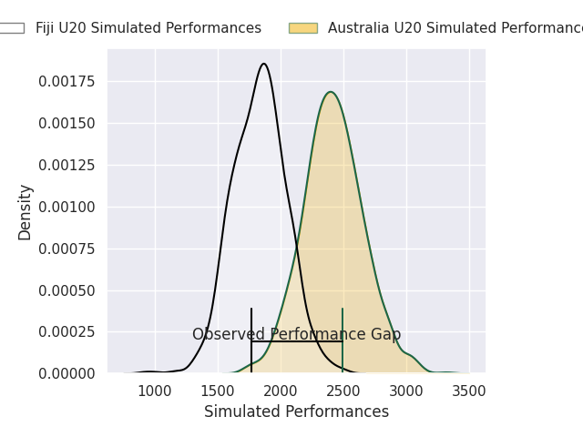
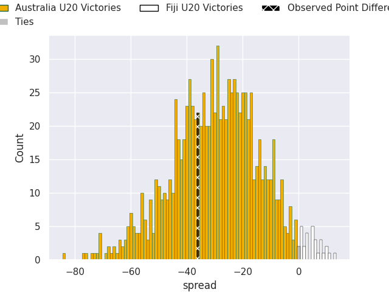
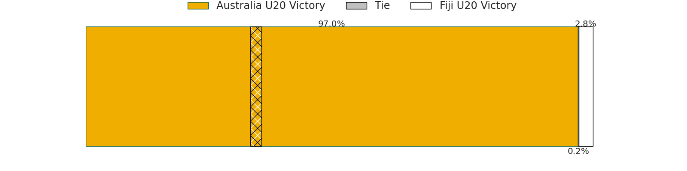

# Australia U20 V Fiji U20 on 2026/07/02, 53.0 to 17.0

# Club Level Predictions

Now that the game has been played, lets see how the club predictions did. I predicted Australia U20 to win by 29.39, and Australia U20 won by 36.0. That's an absolute error of 6.6 for the margin of victory, while my average absolute error has been 14.5 over the past six months. This prediction was more accurate than 68.1% of my recent predictions.

For the Over/Under model, I predicted a total of 55.5 and we have an actual total of 70.0. That's an absolute error of 14.5 compared to a six month average of 14.5. This prediction was more accurate than 41.3% of my recent predictions.
## Projected Performances - Club Model

## Projected Spreads - Club Model

## Projected Results - Club Model

