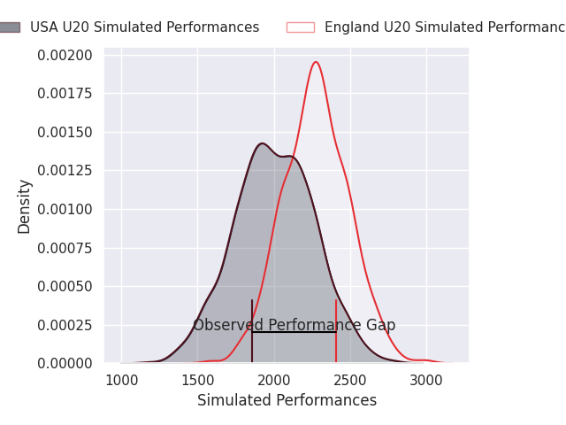
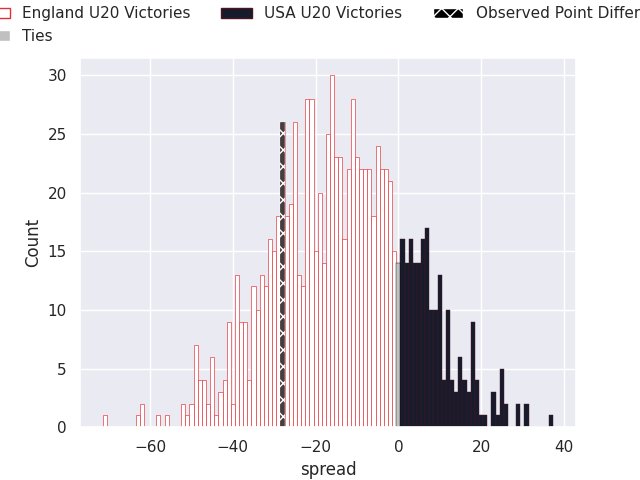
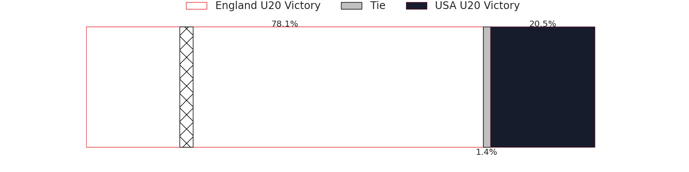

# England U20 V USA U20 on 2026/07/02, 68.0 to 40.0

# Club Level Predictions

Now that the game has been played, lets see how the club predictions did. I predicted England U20 to win by 13.6, and England U20 won by 28.0. That's an absolute error of 14.4 for the margin of victory, while my average absolute error has been 14.5 over the past six months. This prediction was more accurate than 39.6% of my recent predictions.

For the Over/Under model, I predicted a total of 55.5 and we have an actual total of 108.0. That's an absolute error of 52.5 compared to a six month average of 14.5. This prediction was more accurate than 0.4% of my recent predictions.
## Projected Performances - Club Model

## Projected Spreads - Club Model

## Projected Results - Club Model

