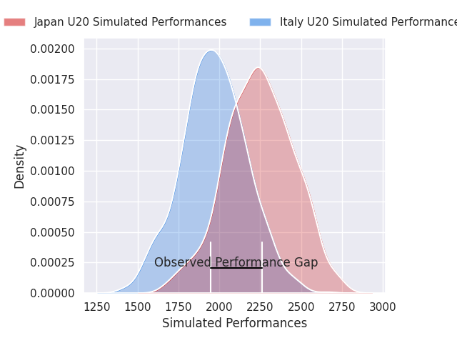
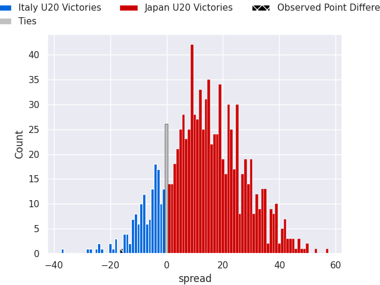
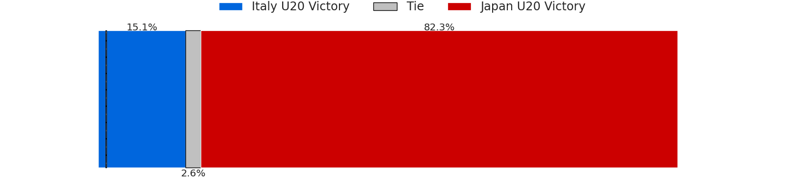

# Italy U20 V Japan U20 on 2026/07/02, 41.0 to 25.0

# Club Level Predictions

Now that the game has been played, lets see how the club predictions did. I predicted Japan U20 to win by 13.78, and Italy U20 won by 16.0. That's an absolute error of 29.8 for the margin of victory, while my average absolute error has been 14.4 over the past six months. This prediction was more accurate than 11.8% of my recent predictions.

For the Over/Under model, I predicted a total of 54.5 and we have an actual total of 66.0. That's an absolute error of 11.5 compared to a six month average of 14.3. This prediction was more accurate than 51.3% of my recent predictions.
## Projected Performances - Club Model

## Projected Spreads - Club Model

## Projected Results - Club Model

