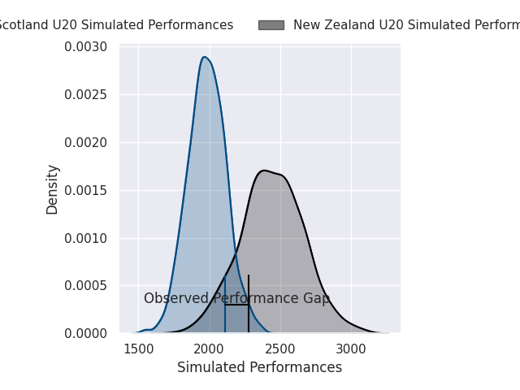
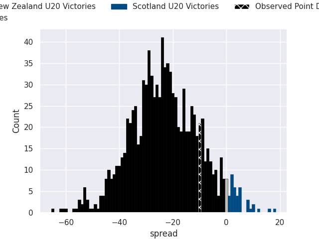

# New Zealand U20 V Scotland U20 on 2026/07/02, 36.0 to 26.0

# Club Level Predictions

Now that the game has been played, lets see how the club predictions did. I predicted New Zealand U20 to win by 23.01, and New Zealand U20 won by 10.0. That's an absolute error of 13.0 for the margin of victory, while my average absolute error has been 14.5 over the past six months. This prediction was more accurate than 44.8% of my recent predictions.

For the Over/Under model, I predicted a total of 53.5 and we have an actual total of 62.0. That's an absolute error of 8.5 compared to a six month average of 14.5. This prediction was more accurate than 63.9% of my recent predictions.
## Projected Performances - Club Model

## Projected Spreads - Club Model

## Projected Results - Club Model

