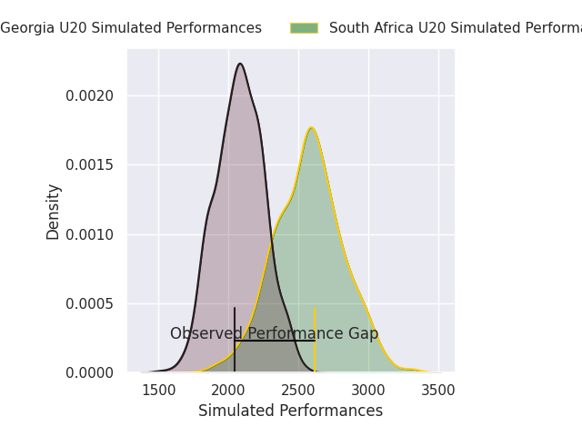
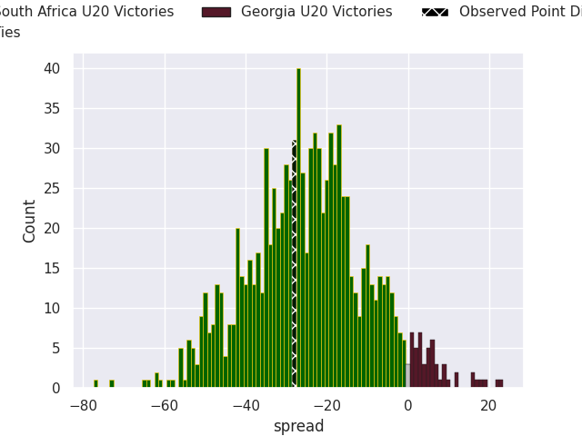

# South Africa U20 V Georgia U20 on 2026/07/02, 33.0 to 5.0

# Club Level Predictions

Now that the game has been played, lets see how the club predictions did. I predicted South Africa U20 to win by 24.61, and South Africa U20 won by 28.0. That's an absolute error of 3.4 for the margin of victory, while my average absolute error has been 14.5 over the past six months. This prediction was more accurate than 83.0% of my recent predictions.

For the Over/Under model, I predicted a total of 49.5 and we have an actual total of 38.0. That's an absolute error of 11.5 compared to a six month average of 14.5. This prediction was more accurate than 51.8% of my recent predictions.
## Projected Performances - Club Model

## Projected Spreads - Club Model

## Projected Results - Club Model

