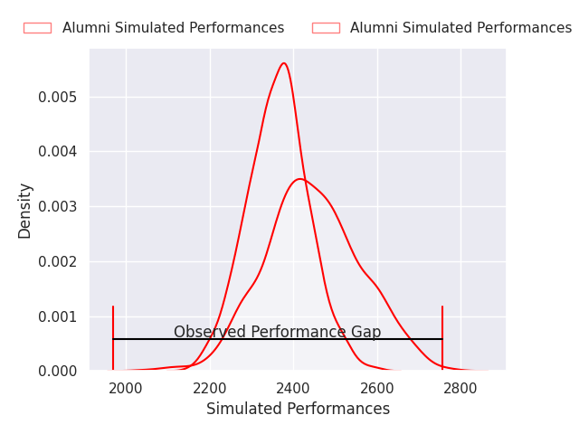
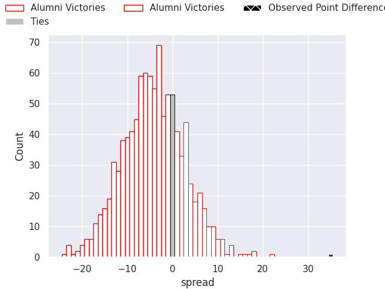
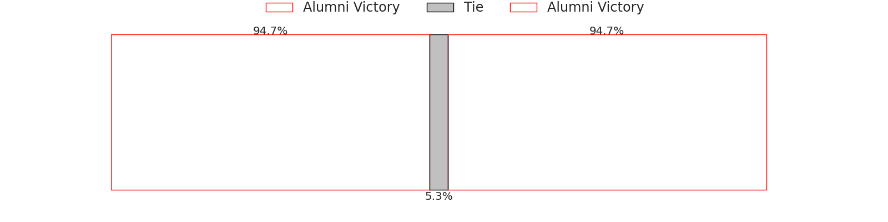

# Alumni V CUBA on 2026/07/04, 31.0 to 66.0

# Club Level Predictions

Now that the game has been played, lets see how the club predictions did. I predicted Alumni to win by 4.19, and Alumni won by 35.0. That's an absolute error of 39.2 for the margin of victory, while my average absolute error has been 14.5 over the past six months. This prediction was more accurate than 5.1% of my recent predictions.

For the Over/Under model, I predicted a total of 71.5 and we have an actual total of 97.0. That's an absolute error of 25.5 compared to a six month average of 14.5. This prediction was more accurate than 17.8% of my recent predictions.
## Projected Performances - Club Model

## Projected Spreads - Club Model

## Projected Results - Club Model

