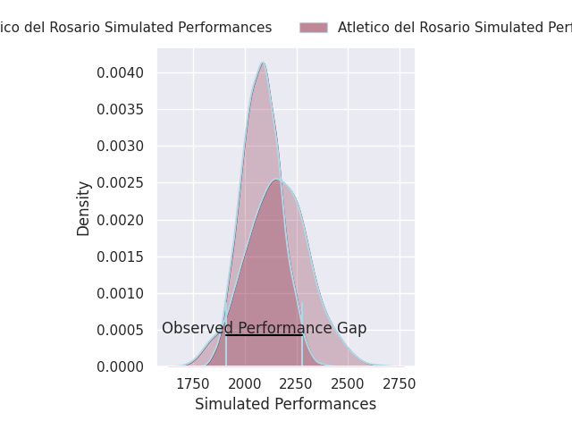
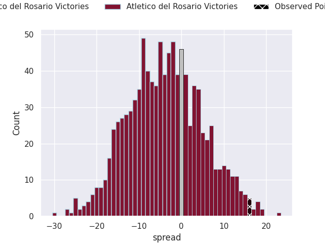

# Atlético del Rosario V La Plata on 2026/07/04, 25.0 to 41.0

# Club Level Predictions

Now that the game has been played, lets see how the club predictions did. I predicted Atletico del Rosario to win by 3.83, and Atletico del Rosario won by 16.0. That's an absolute error of 19.8 for the margin of victory, while my average absolute error has been 14.5 over the past six months. This prediction was more accurate than 25.6% of my recent predictions.

For the Over/Under model, I predicted a total of 51.5 and we have an actual total of 66.0. That's an absolute error of 14.5 compared to a six month average of 14.5. This prediction was more accurate than 41.3% of my recent predictions.
## Projected Performances - Club Model

## Projected Spreads - Club Model

## Projected Results - Club Model

