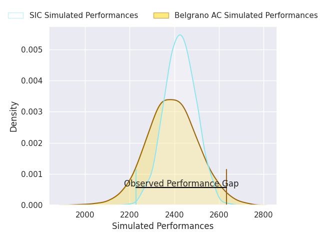
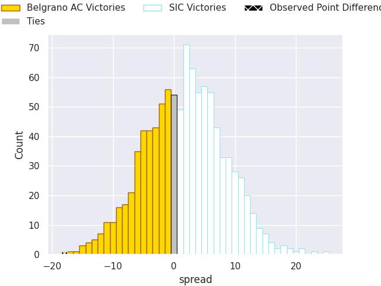
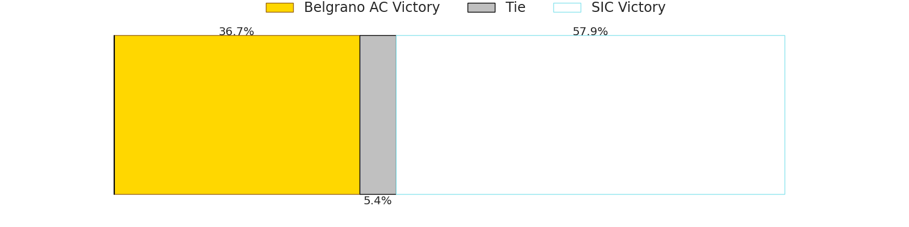

# Belgrano AC V SIC on 2026/07/04, 58.0 to 40.0

# Club Level Predictions

Now that the game has been played, lets see how the club predictions did. I predicted SIC to win by 1.76, and Belgrano AC won by 18.0. That's an absolute error of 19.8 for the margin of victory, while my average absolute error has been 14.5 over the past six months. This prediction was more accurate than 25.7% of my recent predictions.

For the Over/Under model, I predicted a total of 55.5 and we have an actual total of 98.0. That's an absolute error of 42.5 compared to a six month average of 14.5. This prediction was more accurate than 1.9% of my recent predictions.
## Projected Performances - Club Model

## Projected Spreads - Club Model

## Projected Results - Club Model

