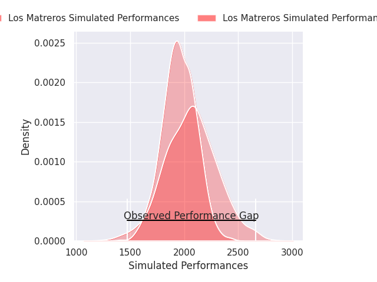
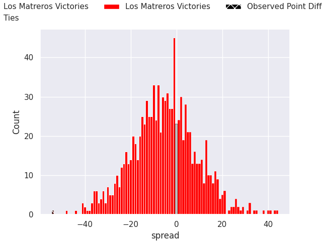

# Los Matreros V Regatas Bella Vista on 2026/07/04, 61.0 to 7.0

# Club Level Predictions

Now that the game has been played, lets see how the club predictions did. I predicted Los Matreros to win by 5.33, and Los Matreros won by 54.0. That's an absolute error of 48.7 for the margin of victory, while my average absolute error has been 14.5 over the past six months. This prediction was more accurate than 2.0% of my recent predictions.

For the Over/Under model, I predicted a total of 49.5 and we have an actual total of 68.0. That's an absolute error of 18.5 compared to a six month average of 14.5. This prediction was more accurate than 30.4% of my recent predictions.
## Projected Performances - Club Model

## Projected Spreads - Club Model

## Projected Results - Club Model

