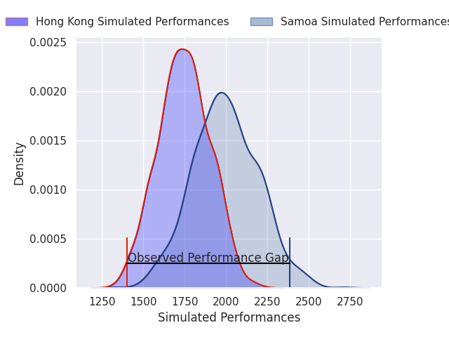
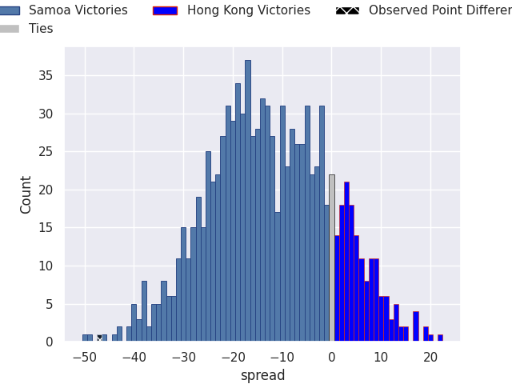
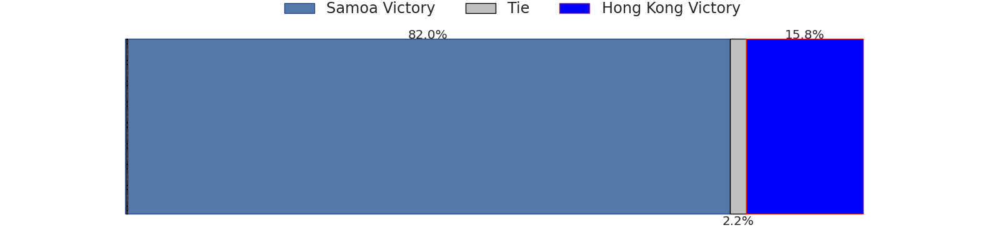

# Samoa V Hong Kong on 2026/07/04, 66.0 to 19.0

# Club Level Predictions

Now that the game has been played, lets see how the club predictions did. I predicted Samoa to win by 12.51, and Samoa won by 47.0. That's an absolute error of 34.5 for the margin of victory, while my average absolute error has been 14.5 over the past six months. This prediction was more accurate than 8.0% of my recent predictions.

For the Over/Under model, I predicted a total of 49.5 and we have an actual total of 85.0. That's an absolute error of 35.5 compared to a six month average of 14.5. This prediction was more accurate than 5.2% of my recent predictions.
## Projected Performances - Club Model

## Projected Spreads - Club Model

## Projected Results - Club Model

