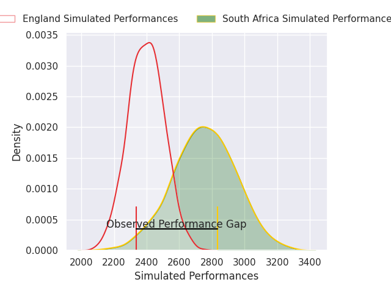
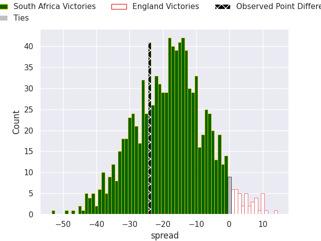
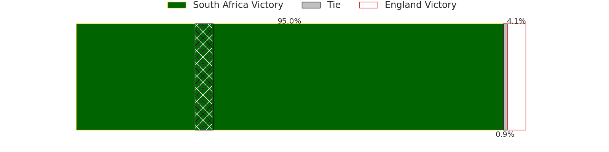
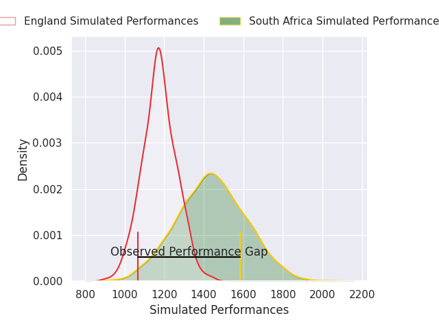
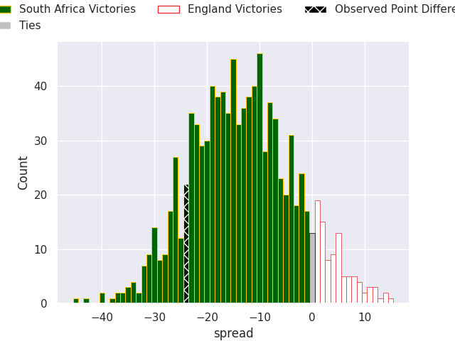
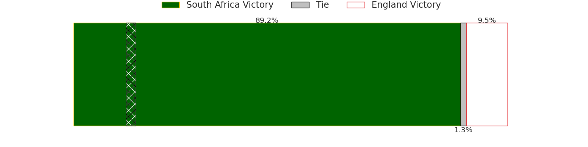

# South Africa V England on 2026/07/04, 45.0 to 21.0

# Club Level Predictions

Now that the game has been played, lets see how the club predictions did. I predicted South Africa to win by 17.78, and South Africa won by 24.0. That's an absolute error of 6.2 for the margin of victory, while my average absolute error has been 14.5 over the past six months. This prediction was more accurate than 70.4% of my recent predictions.

For the Over/Under model, I predicted a total of 49.5 and we have an actual total of 66.0. That's an absolute error of 16.5 compared to a six month average of 14.5. This prediction was more accurate than 34.7% of my recent predictions.
## Projected Performances - Club Model

## Projected Spreads - Club Model

## Projected Results - Club Model

# Player Level Predictions

With the player model, I predicted South Africa to win by 13.23,  and South Africa won by 24.0. That's an absolute error of 10.8 for the margin of victory, while the average error as been 14.3 for the past six months. So this prediction was more accurate than 41.0% of my recent predictions.
## Projected Performances - Player Model

## Projected Spreads - Player Model

## Projected Results - Player Model

