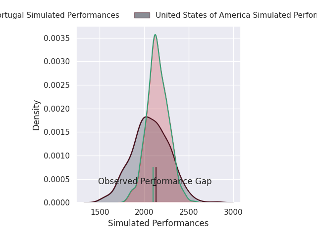
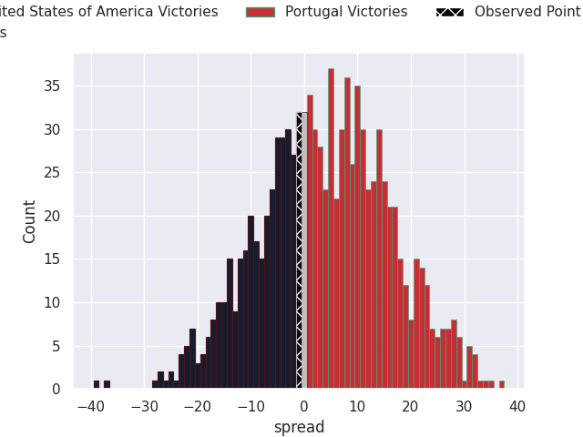
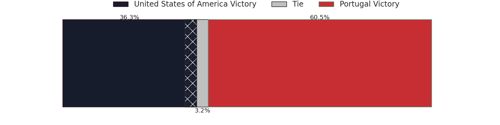
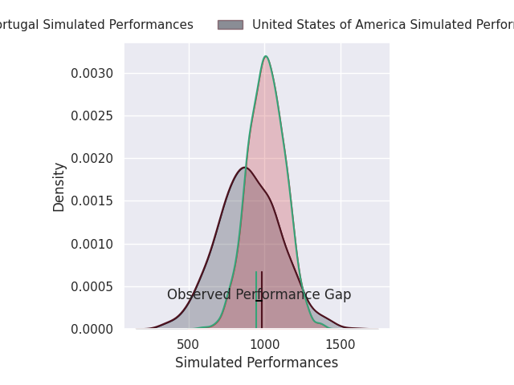
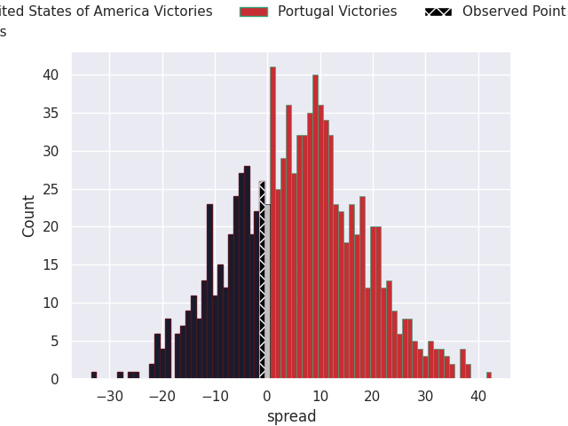

# United States of America V Portugal on 2026/07/04, 30.0 to 29.0

# Club Level Predictions

Now that the game has been played, lets see how the club predictions did. I predicted Portugal to win by 3.99, and United States of America won by 1.0. That's an absolute error of 5.0 for the margin of victory, while my average absolute error has been 14.5 over the past six months. This prediction was more accurate than 75.6% of my recent predictions.

For the Over/Under model, I predicted a total of 49.5 and we have an actual total of 59.0. That's an absolute error of 9.5 compared to a six month average of 14.5. This prediction was more accurate than 57.7% of my recent predictions.
## Projected Performances - Club Model

## Projected Spreads - Club Model

## Projected Results - Club Model

# Player Level Predictions

With the player model, I predicted Portugal to win by 5.71,  and United States of America won by 1.0. That's an absolute error of 6.7 for the margin of victory, while the average error as been 14.3 for the past six months. So this prediction was more accurate than 55.0% of my recent predictions.
## Projected Performances - Player Model

## Projected Spreads - Player Model

## Projected Results - Player Model

