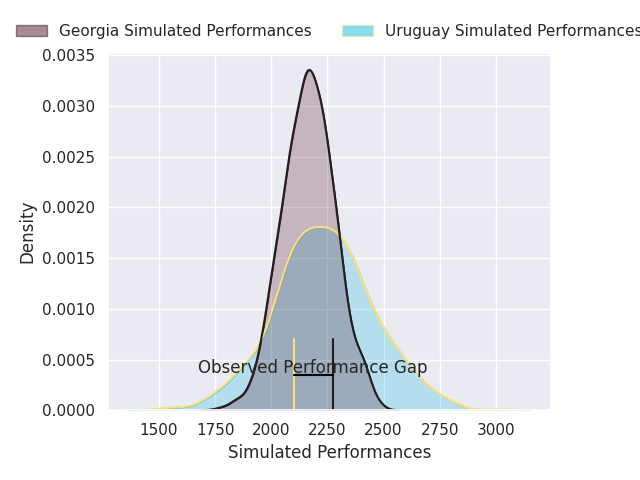
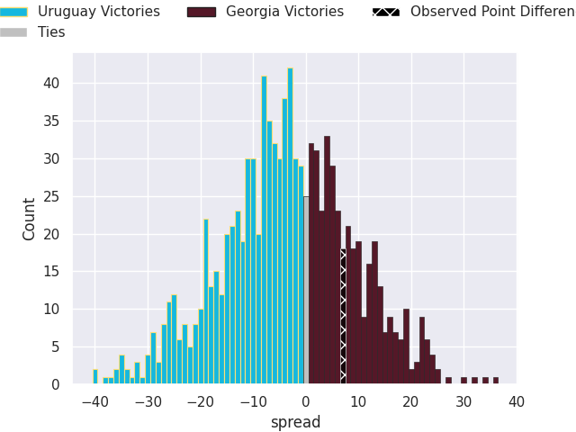
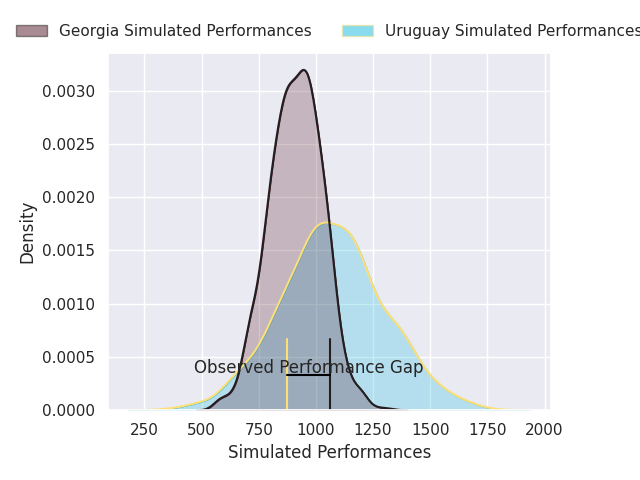
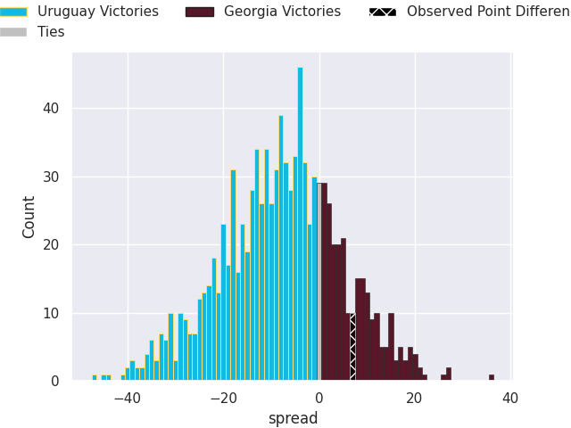

# Uruguay V Georgia on 2026/07/04, 34.0 to 41.0

# Club Level Predictions

Now that the game has been played, lets see how the club predictions did. I predicted Uruguay to win by 3.57, and Georgia won by 7.0. That's an absolute error of 10.6 for the margin of victory, while my average absolute error has been 14.5 over the past six months. This prediction was more accurate than 53.0% of my recent predictions.

For the Over/Under model, I predicted a total of 48.5 and we have an actual total of 75.0. That's an absolute error of 26.5 compared to a six month average of 14.5. This prediction was more accurate than 15.9% of my recent predictions.
## Projected Performances - Club Model

## Projected Spreads - Club Model

## Projected Results - Club Model

# Player Level Predictions

With the player model, I predicted Uruguay to win by 7.98,  and Georgia won by 7.0. That's an absolute error of 15.0 for the margin of victory, while the average error as been 14.3 for the past six months. So this prediction was more accurate than 29.7% of my recent predictions.
## Projected Performances - Player Model

## Projected Spreads - Player Model

## Projected Results - Player Model

