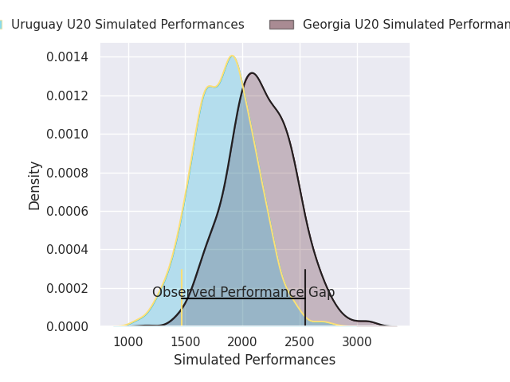
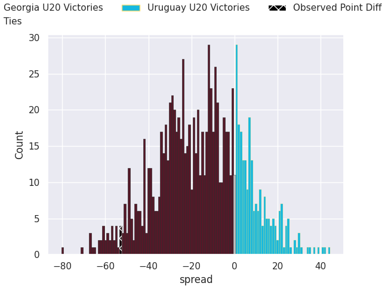
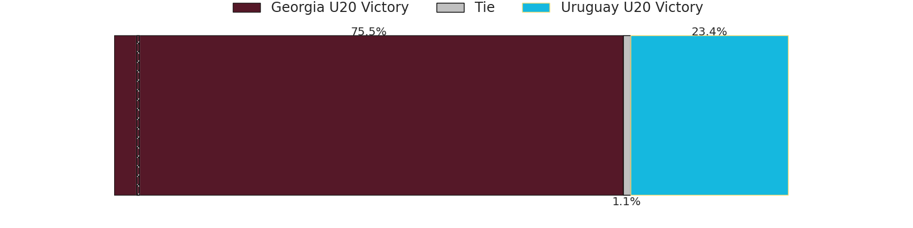

# Georgia U20 V Uruguay U20 on 2026/07/07, 56.0 to 3.0

# Club Level Predictions

Now that the game has been played, lets see how the club predictions did. I predicted Georgia U20 to win by 15.53, and Georgia U20 won by 53.0. That's an absolute error of 37.5 for the margin of victory, while my average absolute error has been 14.5 over the past six months. This prediction was more accurate than 6.3% of my recent predictions.

For the Over/Under model, I predicted a total of 49.5 and we have an actual total of 59.0. That's an absolute error of 9.5 compared to a six month average of 14.5. This prediction was more accurate than 57.7% of my recent predictions.
## Projected Performances - Club Model

## Projected Spreads - Club Model

## Projected Results - Club Model

