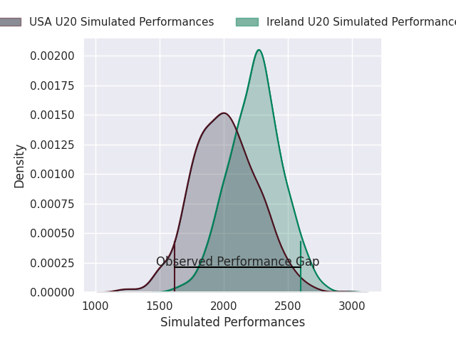
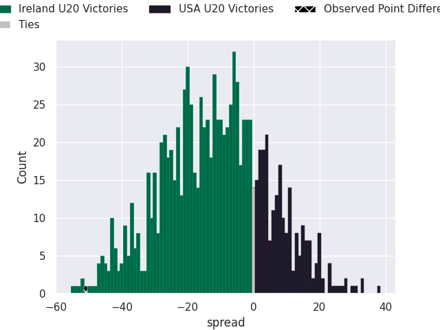
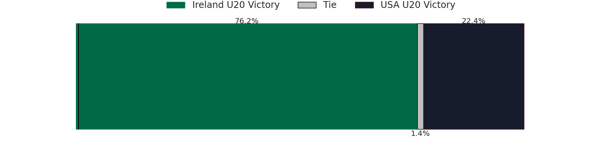

# Ireland U20 V USA U20 on 2026/07/07, 73.0 to 22.0

# Club Level Predictions

Now that the game has been played, lets see how the club predictions did. I predicted Ireland U20 to win by 11.82, and Ireland U20 won by 51.0. That's an absolute error of 39.2 for the margin of victory, while my average absolute error has been 14.7 over the past six months. This prediction was more accurate than 5.2% of my recent predictions.

For the Over/Under model, I predicted a total of 54.5 and we have an actual total of 95.0. That's an absolute error of 40.5 compared to a six month average of 14.4. This prediction was more accurate than 2.2% of my recent predictions.
## Projected Performances - Club Model

## Projected Spreads - Club Model

## Projected Results - Club Model

