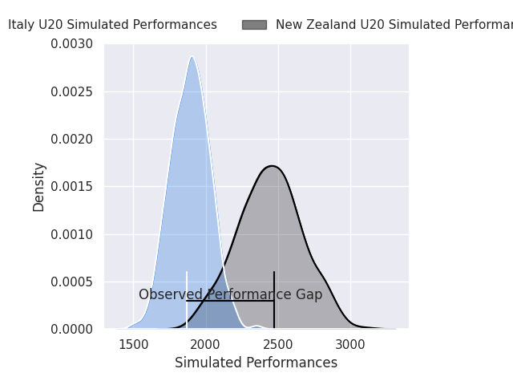
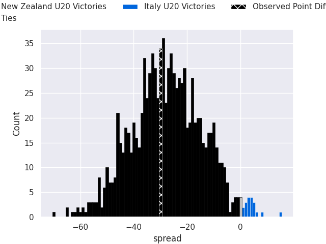

# New Zealand U20 V Italy U20 on 2026/07/07, 45.0 to 15.0

# Club Level Predictions

Now that the game has been played, lets see how the club predictions did. I predicted New Zealand U20 to win by 27.5, and New Zealand U20 won by 30.0. That's an absolute error of 2.5 for the margin of victory, while my average absolute error has been 14.7 over the past six months. This prediction was more accurate than 86.9% of my recent predictions.

For the Over/Under model, I predicted a total of 54.5 and we have an actual total of 60.0. That's an absolute error of 5.5 compared to a six month average of 14.4. This prediction was more accurate than 75.3% of my recent predictions.
## Projected Performances - Club Model

## Projected Spreads - Club Model

## Projected Results - Club Model

