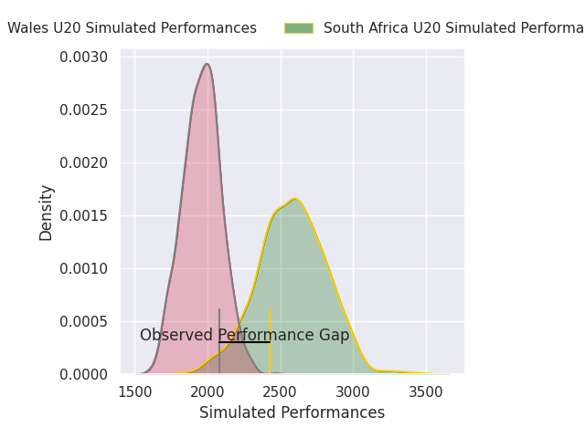
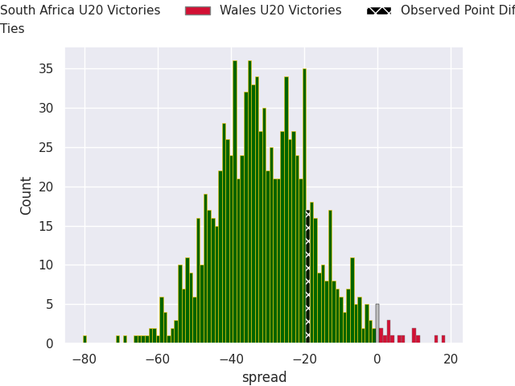

# South Africa U20 V Wales U20 on 2026/07/07, 52.0 to 33.0

# Club Level Predictions

Now that the game has been played, lets see how the club predictions did. I predicted South Africa U20 to win by 30.9, and South Africa U20 won by 19.0. That's an absolute error of 11.9 for the margin of victory, while my average absolute error has been 14.7 over the past six months. This prediction was more accurate than 49.1% of my recent predictions.

For the Over/Under model, I predicted a total of 53.5 and we have an actual total of 85.0. That's an absolute error of 31.5 compared to a six month average of 14.4. This prediction was more accurate than 8.6% of my recent predictions.
## Projected Performances - Club Model

## Projected Spreads - Club Model

## Projected Results - Club Model

