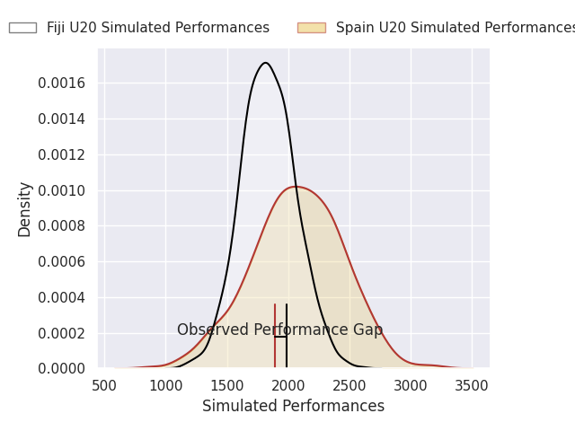
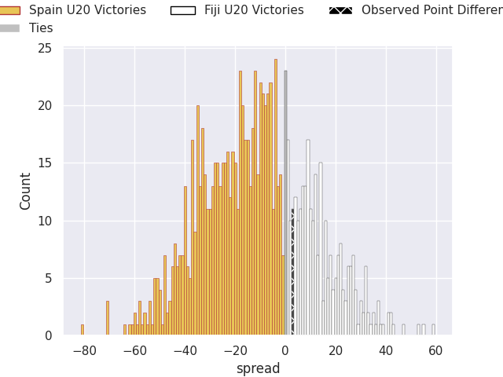
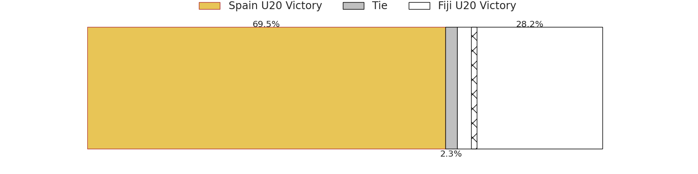

# Spain U20 V Fiji U20 on 2026/07/07, 26.0 to 29.0

# Club Level Predictions

Now that the game has been played, lets see how the club predictions did. I predicted Spain U20 to win by 11.62, and Fiji U20 won by 3.0. That's an absolute error of 14.6 for the margin of victory, while my average absolute error has been 14.7 over the past six months. This prediction was more accurate than 39.7% of my recent predictions.

For the Over/Under model, I predicted a total of 54.5 and we have an actual total of 55.0. That's an absolute error of 0.5 compared to a six month average of 14.4. This prediction was more accurate than 97.5% of my recent predictions.
## Projected Performances - Club Model

## Projected Spreads - Club Model

## Projected Results - Club Model

