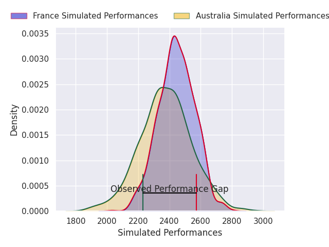
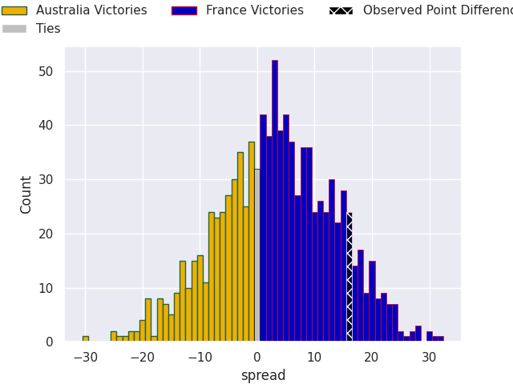
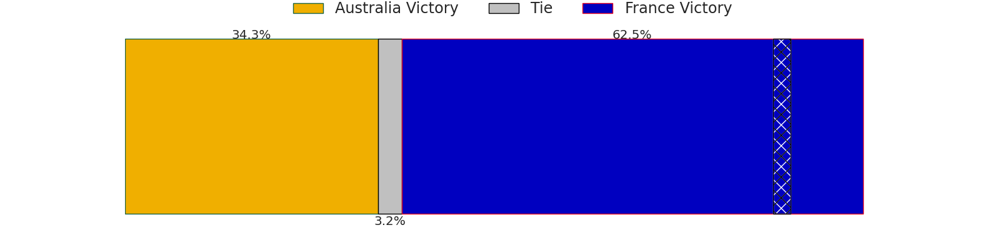
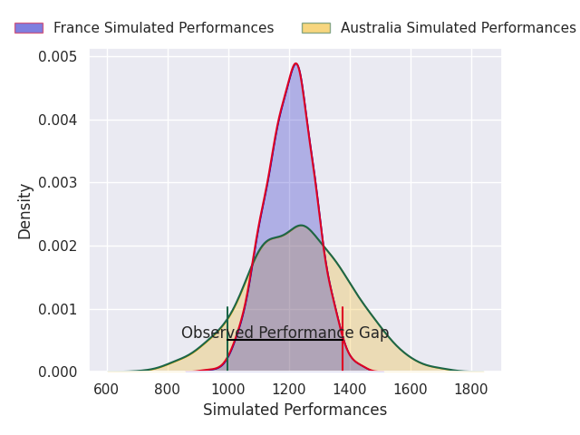
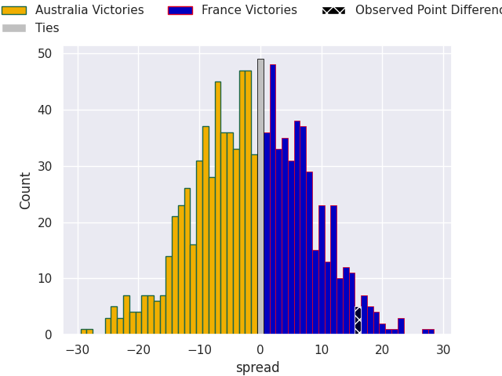
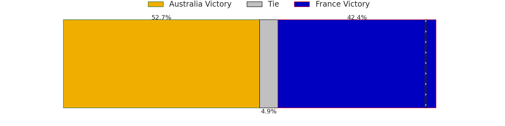

# Australia V France on 2026/07/11, 26.0 to 42.0

# Club Level Predictions

Now that the game has been played, lets see how the club predictions did. I predicted France to win by 3.43, and France won by 16.0. That's an absolute error of 12.6 for the margin of victory, while my average absolute error has been 14.7 over the past six months. This prediction was more accurate than 46.5% of my recent predictions.

For the Over/Under model, I predicted a total of 53.5 and we have an actual total of 68.0. That's an absolute error of 14.5 compared to a six month average of 14.4. This prediction was more accurate than 41.2% of my recent predictions.
## Projected Performances - Club Model

## Projected Spreads - Club Model

## Projected Results - Club Model

# Player Level Predictions

With the player model, I predicted Australia to win by 1.32,  and France won by 16.0. That's an absolute error of 17.3 for the margin of victory, while the average error as been 14.4 for the past six months. So this prediction was more accurate than 24.1% of my recent predictions.
## Projected Performances - Player Model

## Projected Spreads - Player Model

## Projected Results - Player Model

