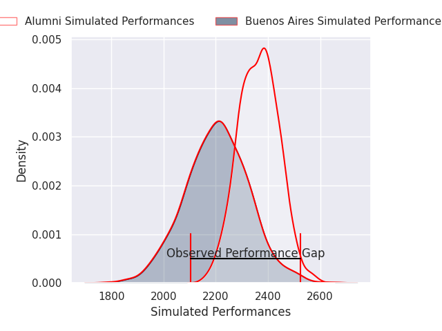
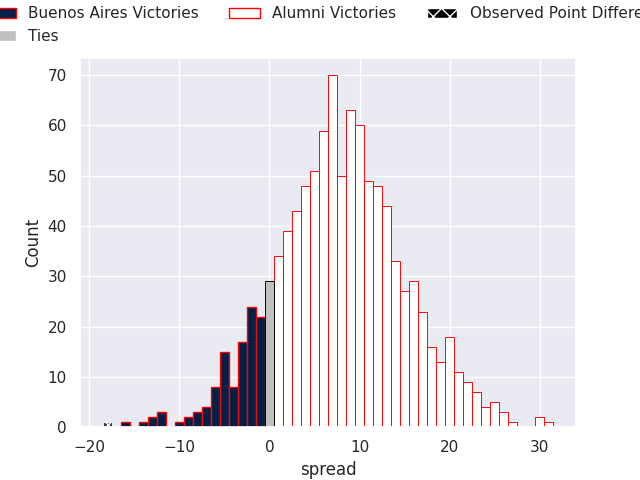
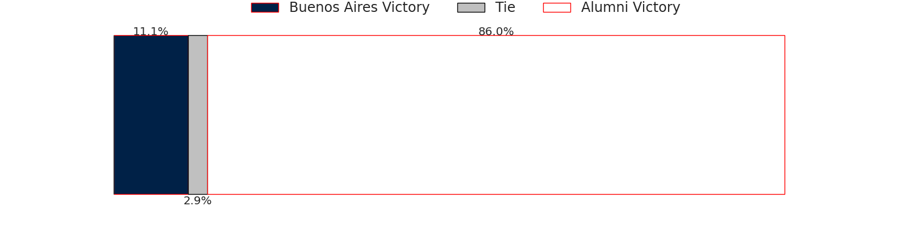

# Buenos Aires V Alumni on 2026/07/11, 43.0 to 25.0

# Club Level Predictions

Now that the game has been played, lets see how the club predictions did. I predicted Alumni to win by 7.96, and Buenos Aires won by 18.0. That's an absolute error of 26.0 for the margin of victory, while my average absolute error has been 14.7 over the past six months. This prediction was more accurate than 16.4% of my recent predictions.

For the Over/Under model, I predicted a total of 53.5 and we have an actual total of 68.0. That's an absolute error of 14.5 compared to a six month average of 14.4. This prediction was more accurate than 41.0% of my recent predictions.
## Projected Performances - Club Model

## Projected Spreads - Club Model

## Projected Results - Club Model

