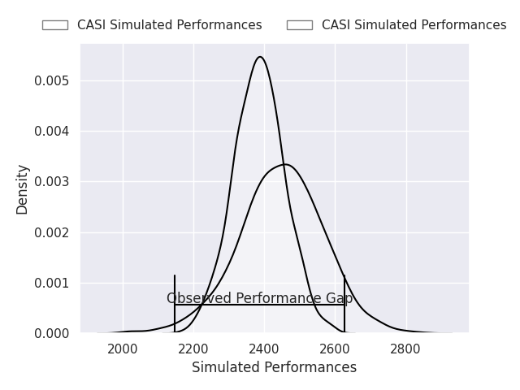
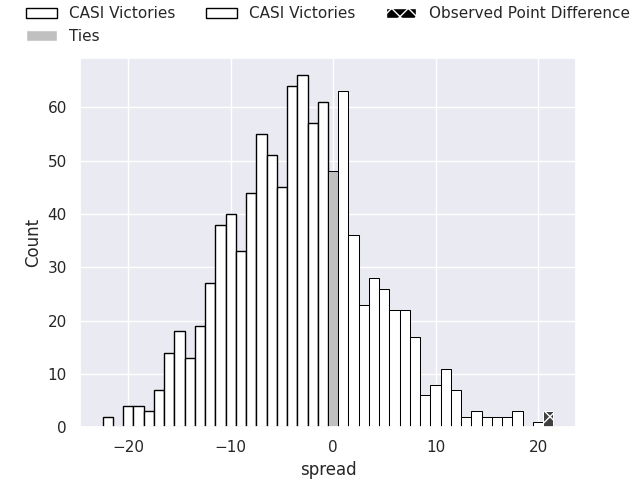
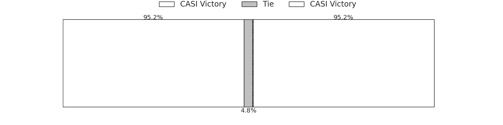

# CASI V Hindu on 2026/07/11, 8.0 to 29.0

# Club Level Predictions

Now that the game has been played, lets see how the club predictions did. I predicted CASI to win by 3.12, and CASI won by 21.0. That's an absolute error of 24.1 for the margin of victory, while my average absolute error has been 14.5 over the past six months. This prediction was more accurate than 18.3% of my recent predictions.

For the Over/Under model, I predicted a total of 57.5 and we have an actual total of 37.0. That's an absolute error of 20.5 compared to a six month average of 14.5. This prediction was more accurate than 25.5% of my recent predictions.
## Projected Performances - Club Model

## Projected Spreads - Club Model

## Projected Results - Club Model

