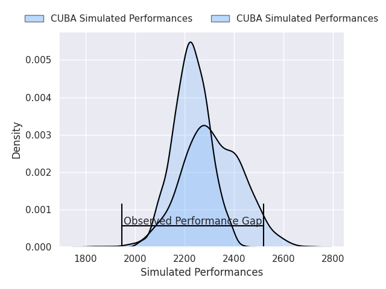
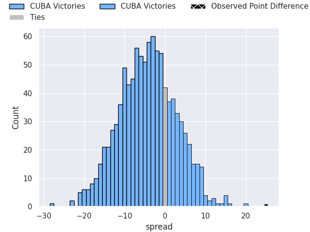

# CUBA V Champagnat on 2026/07/11, 24.0 to 49.0

# Club Level Predictions

Now that the game has been played, lets see how the club predictions did. I predicted CUBA to win by 4.28, and CUBA won by 25.0. That's an absolute error of 29.3 for the margin of victory, while my average absolute error has been 14.7 over the past six months. This prediction was more accurate than 12.8% of my recent predictions.

For the Over/Under model, I predicted a total of 53.5 and we have an actual total of 73.0. That's an absolute error of 19.5 compared to a six month average of 14.4. This prediction was more accurate than 27.6% of my recent predictions.
## Projected Performances - Club Model

## Projected Spreads - Club Model

## Projected Results - Club Model

