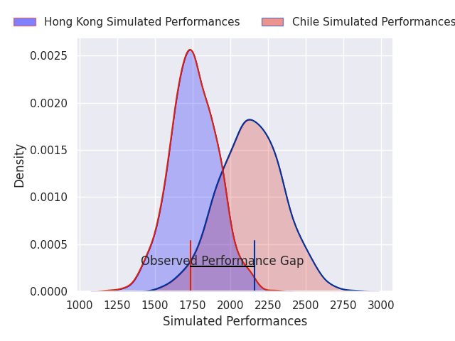
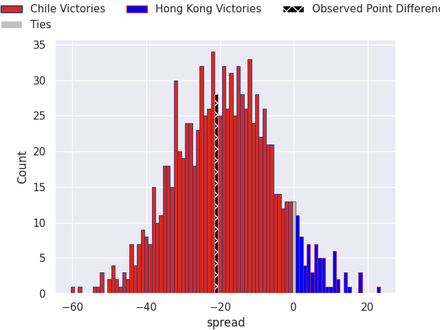

# Chile V Hong Kong on 2026/07/11, 38.0 to 17.0

# Club Level Predictions

Now that the game has been played, lets see how the club predictions did. I predicted Chile to win by 18.88, and Chile won by 21.0. That's an absolute error of 2.1 for the margin of victory, while my average absolute error has been 14.7 over the past six months. This prediction was more accurate than 88.6% of my recent predictions.

For the Over/Under model, I predicted a total of 51.5 and we have an actual total of 55.0. That's an absolute error of 3.5 compared to a six month average of 14.4. This prediction was more accurate than 85.4% of my recent predictions.
## Projected Performances - Club Model

## Projected Spreads - Club Model

## Projected Results - Club Model

