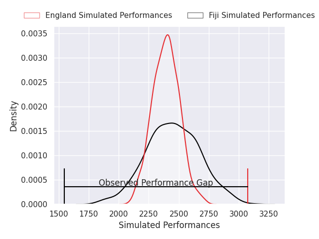
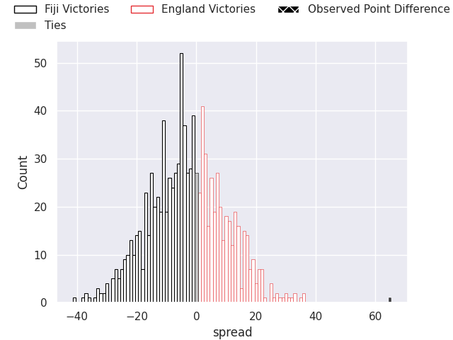
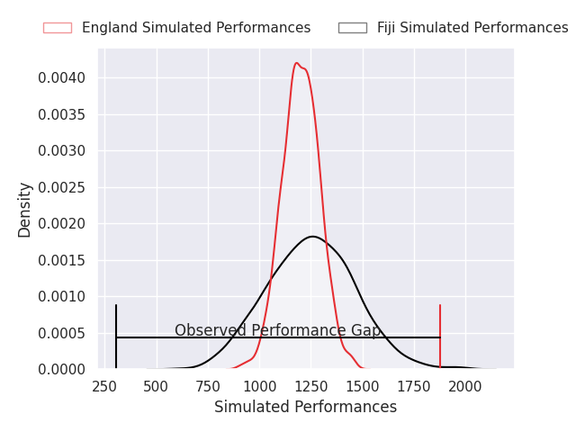
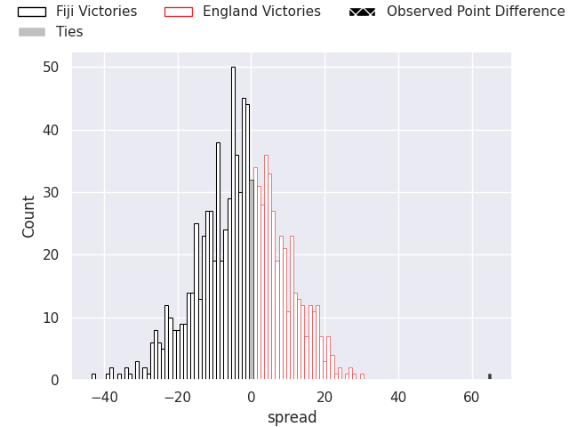
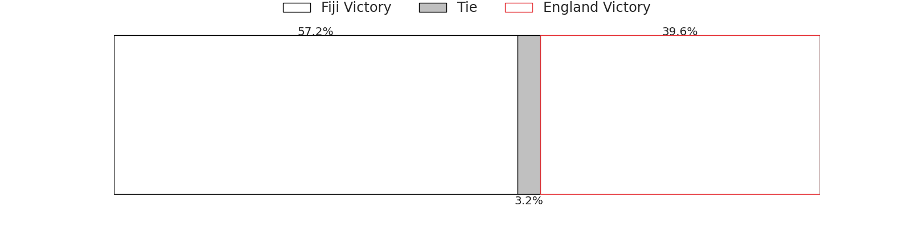

# Fiji V England on 2026/07/11, 8.0 to 73.0

# Club Level Predictions

Now that the game has been played, lets see how the club predictions did. I predicted Fiji to win by 2.92, and England won by 65.0. That's an absolute error of 67.9 for the margin of victory, while my average absolute error has been 14.7 over the past six months. This prediction was more accurate than 0.3% of my recent predictions.

For the Over/Under model, I predicted a total of 52.5 and we have an actual total of 81.0. That's an absolute error of 28.5 compared to a six month average of 14.4. This prediction was more accurate than 12.0% of my recent predictions.
## Projected Performances - Club Model

## Projected Spreads - Club Model

## Projected Results - Club Model

# Player Level Predictions

With the player model, I predicted Fiji to win by 2.49,  and England won by 65.0. That's an absolute error of 67.5 for the margin of victory, while the average error as been 14.4 for the past six months. So this prediction was more accurate than 0.3% of my recent predictions.
## Projected Performances - Player Model

## Projected Spreads - Player Model

## Projected Results - Player Model

