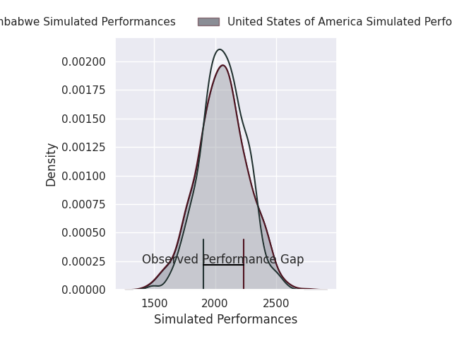
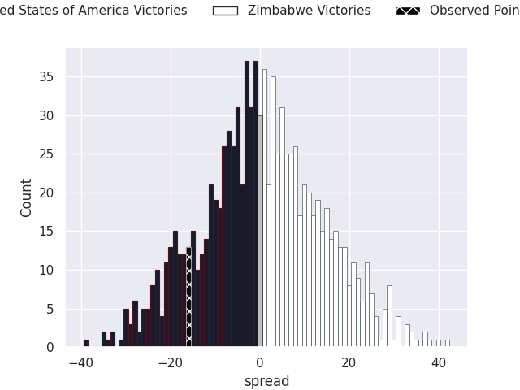

# United States of America V Zimbabwe on 2026/07/11, 31.0 to 15.0

# Club Level Predictions

Now that the game has been played, lets see how the club predictions did. I predicted Zimbabwe to win by 0.55, and United States of America won by 16.0. That's an absolute error of 16.6 for the margin of victory, while my average absolute error has been 14.7 over the past six months. This prediction was more accurate than 33.8% of my recent predictions.

For the Over/Under model, I predicted a total of 47.5 and we have an actual total of 46.0. That's an absolute error of 1.5 compared to a six month average of 14.4. This prediction was more accurate than 93.6% of my recent predictions.
## Projected Performances - Club Model

## Projected Spreads - Club Model

## Projected Results - Club Model

