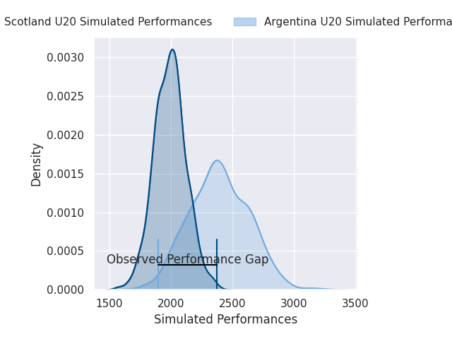
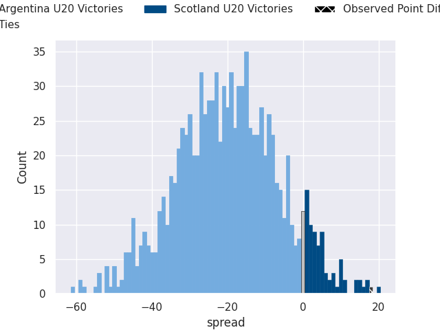
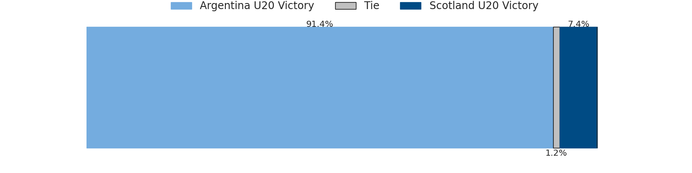

# Argentina U20 V Scotland U20 on 2026/07/12, 26.0 to 44.0

# Club Level Predictions

Now that the game has been played, lets see how the club predictions did. I predicted Argentina U20 to win by 19.97, and Scotland U20 won by 18.0. That's an absolute error of 38.0 for the margin of victory, while my average absolute error has been 14.7 over the past six months. This prediction was more accurate than 6.4% of my recent predictions.

For the Over/Under model, I predicted a total of 55.5 and we have an actual total of 70.0. That's an absolute error of 14.5 compared to a six month average of 14.4. This prediction was more accurate than 41.0% of my recent predictions.
## Projected Performances - Club Model

## Projected Spreads - Club Model

## Projected Results - Club Model

