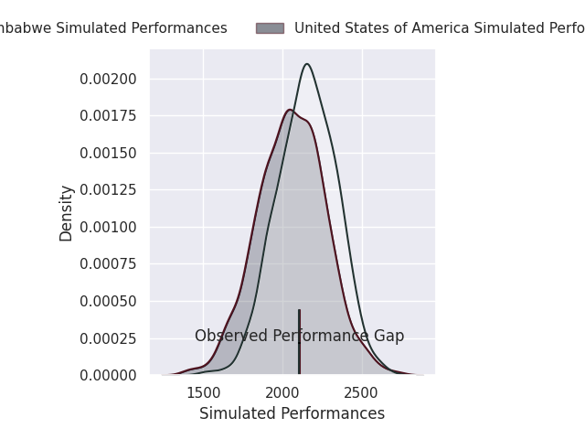
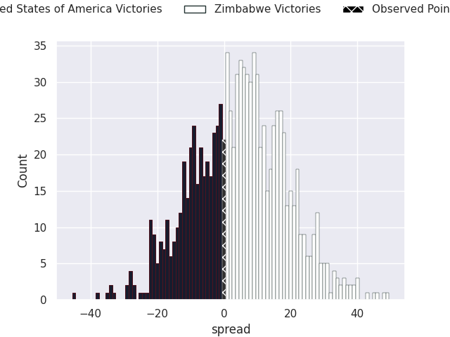

# United States of America V Zimbabwe on 2026/07/12, 0.0 to 0.0

# Club Level Predictions

Now that the game has been played, lets see how the club predictions did. I predicted Zimbabwe to win by 4.78, and Zimbabwe won by 0.0. That's an absolute error of 4.8 for the margin of victory, while my average absolute error has been 14.5 over the past six months. This prediction was more accurate than 77.0% of my recent predictions.

For the Over/Under model, I predicted a total of 45.5 and we have an actual total of 0.0. That's an absolute error of 45.5 compared to a six month average of 14.5. This prediction was more accurate than 1.7% of my recent predictions.
## Projected Performances - Club Model

## Projected Spreads - Club Model

## Projected Results - Club Model

