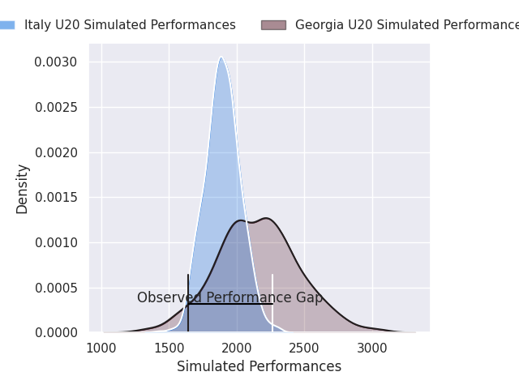
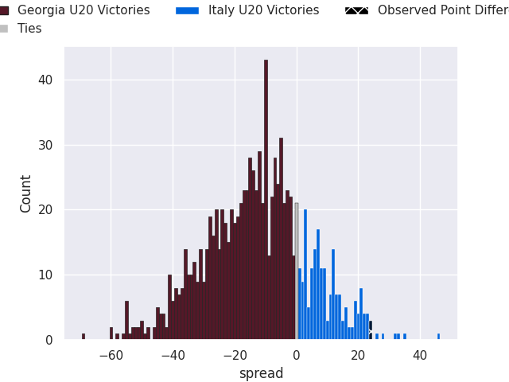

# Georgia U20 V Italy U20 on 2026/07/13, 19.0 to 43.0

# Club Level Predictions

Now that the game has been played, lets see how the club predictions did. I predicted Georgia U20 to win by 12.95, and Italy U20 won by 24.0. That's an absolute error of 37.0 for the margin of victory, while my average absolute error has been 14.6 over the past six months. This prediction was more accurate than 7.0% of my recent predictions.

For the Over/Under model, I predicted a total of 48.5 and we have an actual total of 62.0. That's an absolute error of 13.5 compared to a six month average of 14.2. This prediction was more accurate than 42.6% of my recent predictions.
## Projected Performances - Club Model

## Projected Spreads - Club Model

## Projected Results - Club Model

