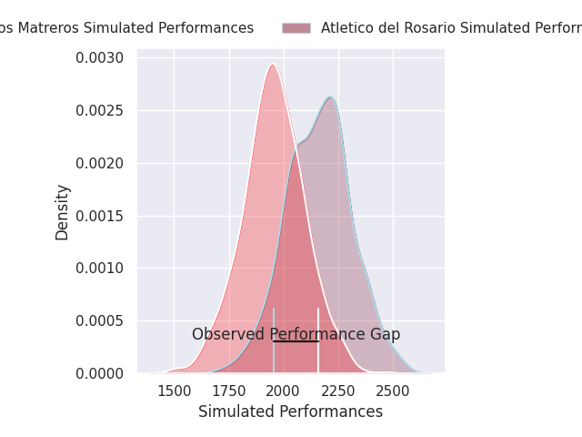
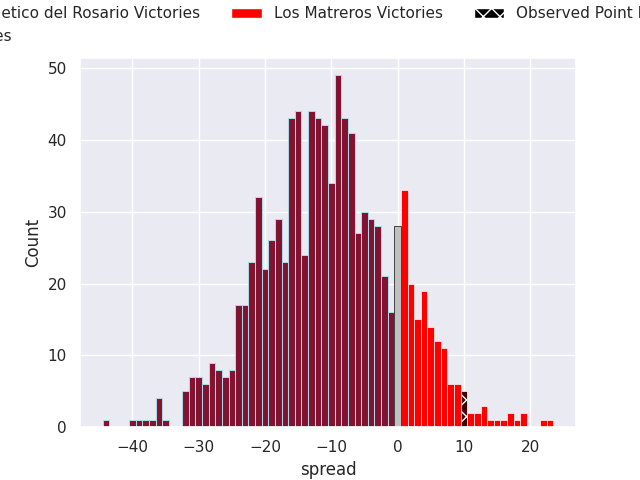
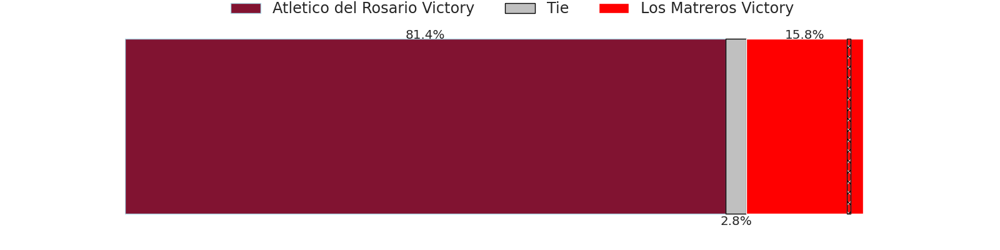

# Atlético del Rosario V Los Matreros on 2026/07/18, 28.0 to 38.0

# Club Level Predictions

Now that the game has been played, lets see how the club predictions did. I predicted Atletico del Rosario to win by 10.2, and Los Matreros won by 10.0. That's an absolute error of 20.2 for the margin of victory, while my average absolute error has been 14.6 over the past six months. This prediction was more accurate than 26.1% of my recent predictions.

For the Over/Under model, I predicted a total of 58.5 and we have an actual total of 66.0. That's an absolute error of 7.5 compared to a six month average of 14.2. This prediction was more accurate than 66.5% of my recent predictions.
## Projected Performances - Club Model

## Projected Spreads - Club Model

## Projected Results - Club Model

