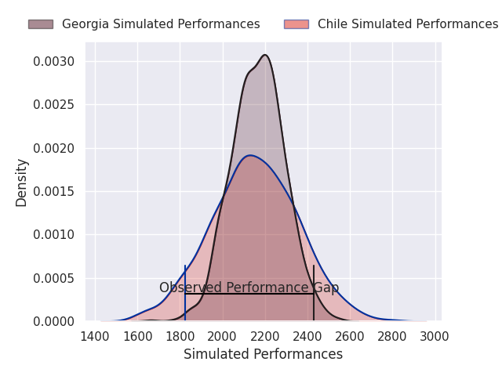
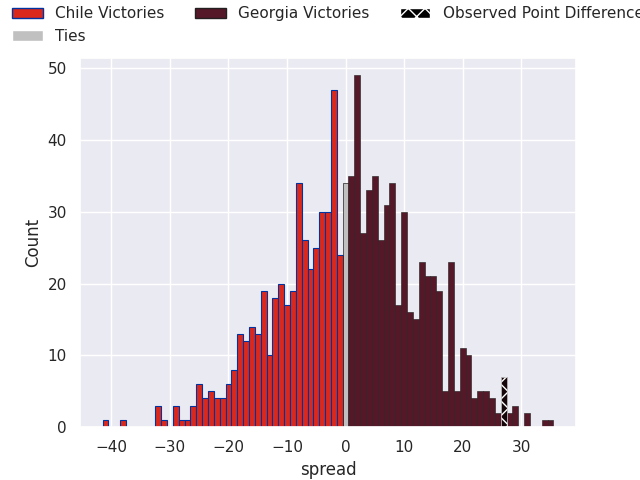
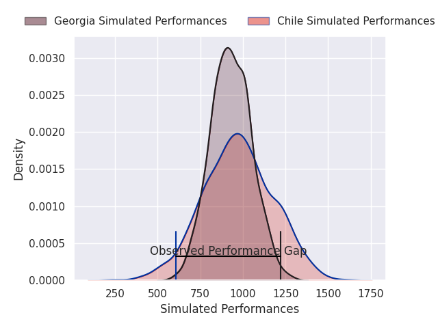
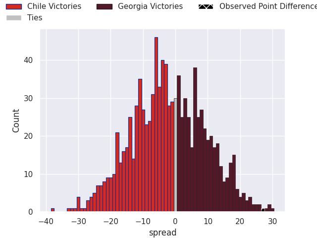

# Chile V Georgia on 2026/07/18, 22.0 to 49.0

# Club Level Predictions

Now that the game has been played, lets see how the club predictions did. I predicted Georgia to win by 0.85, and Georgia won by 27.0. That's an absolute error of 26.2 for the margin of victory, while my average absolute error has been 14.6 over the past six months. This prediction was more accurate than 16.1% of my recent predictions.

For the Over/Under model, I predicted a total of 50.5 and we have an actual total of 71.0. That's an absolute error of 20.5 compared to a six month average of 14.2. This prediction was more accurate than 25.4% of my recent predictions.
## Projected Performances - Club Model

## Projected Spreads - Club Model

## Projected Results - Club Model

# Player Level Predictions

With the player model, I predicted Chile to win by 2.04,  and Georgia won by 27.0. That's an absolute error of 29.0 for the margin of victory, while the average error as been 14.4 for the past six months. So this prediction was more accurate than 8.9% of my recent predictions.
## Projected Performances - Player Model

## Projected Spreads - Player Model

## Projected Results - Player Model

