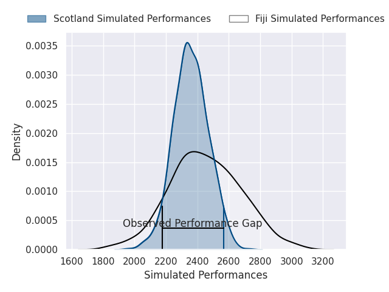
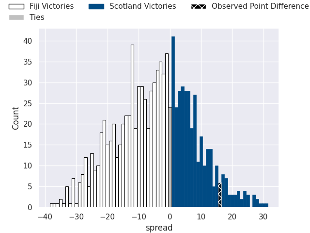
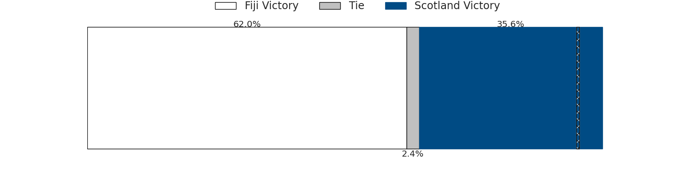
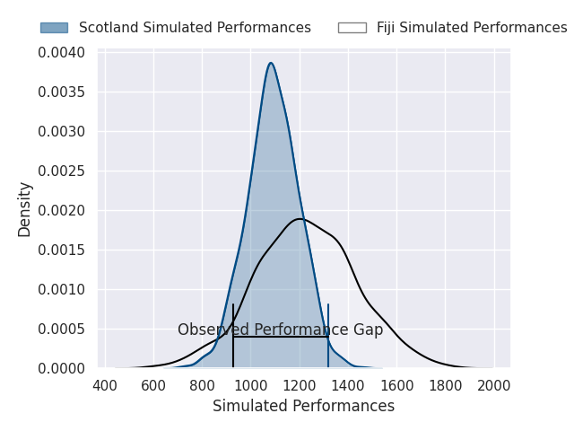
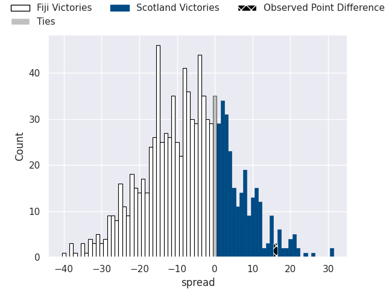
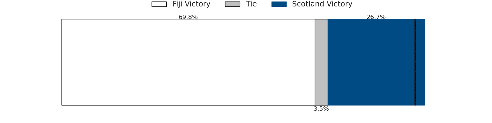

# Fiji V Scotland on 2026/07/18, 17.0 to 33.0

# Club Level Predictions

Now that the game has been played, lets see how the club predictions did. I predicted Fiji to win by 4.68, and Scotland won by 16.0. That's an absolute error of 20.7 for the margin of victory, while my average absolute error has been 14.6 over the past six months. This prediction was more accurate than 24.6% of my recent predictions.

For the Over/Under model, I predicted a total of 52.5 and we have an actual total of 50.0. That's an absolute error of 2.5 compared to a six month average of 14.2. This prediction was more accurate than 89.4% of my recent predictions.
## Projected Performances - Club Model

## Projected Spreads - Club Model

## Projected Results - Club Model

# Player Level Predictions

With the player model, I predicted Fiji to win by 6.73,  and Scotland won by 16.0. That's an absolute error of 22.7 for the margin of victory, while the average error as been 14.4 for the past six months. So this prediction was more accurate than 15.6% of my recent predictions.
## Projected Performances - Player Model

## Projected Spreads - Player Model

## Projected Results - Player Model

