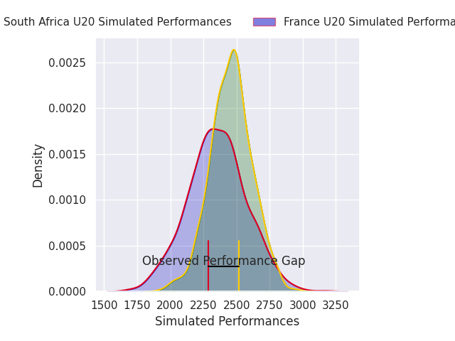
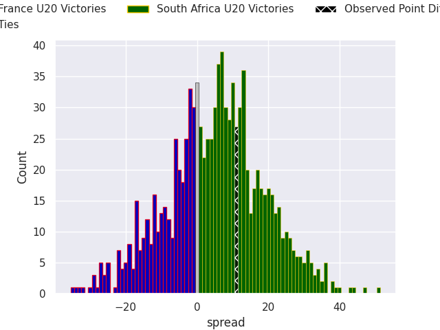
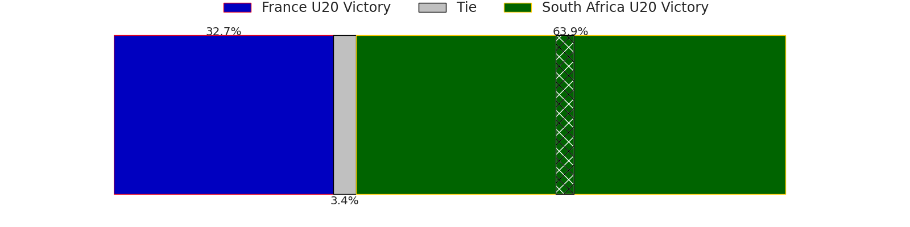

# France U20 V South Africa U20 on 2026/07/18, 5.0 to 16.0

# Club Level Predictions

Now that the game has been played, lets see how the club predictions did. I predicted South Africa U20 to win by 5.23, and South Africa U20 won by 11.0. That's an absolute error of 5.8 for the margin of victory, while my average absolute error has been 14.6 over the past six months. This prediction was more accurate than 72.1% of my recent predictions.

For the Over/Under model, I predicted a total of 56.5 and we have an actual total of 21.0. That's an absolute error of 35.5 compared to a six month average of 14.2. This prediction was more accurate than 4.5% of my recent predictions.
## Projected Performances - Club Model

## Projected Spreads - Club Model

## Projected Results - Club Model

