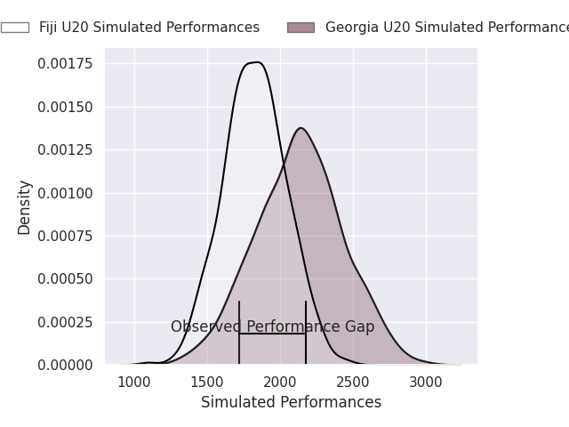
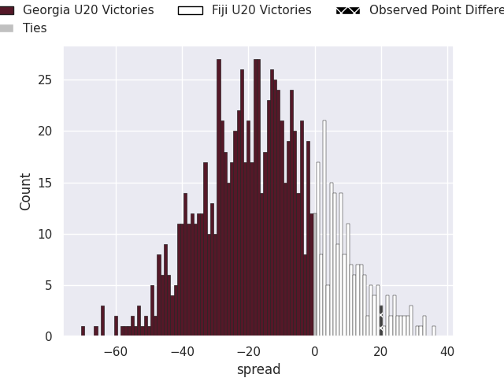

# Georgia U20 V Fiji U20 on 2026/07/18, 10.0 to 30.0

# Club Level Predictions

Now that the game has been played, lets see how the club predictions did. I predicted Georgia U20 to win by 15.18, and Fiji U20 won by 20.0. That's an absolute error of 35.2 for the margin of victory, while my average absolute error has been 14.6 over the past six months. This prediction was more accurate than 8.1% of my recent predictions.

For the Over/Under model, I predicted a total of 48.5 and we have an actual total of 40.0. That's an absolute error of 8.5 compared to a six month average of 14.2. This prediction was more accurate than 62.5% of my recent predictions.
## Projected Performances - Club Model

## Projected Spreads - Club Model

## Projected Results - Club Model

