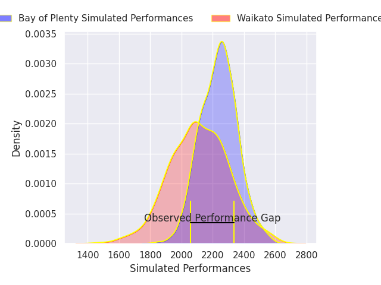
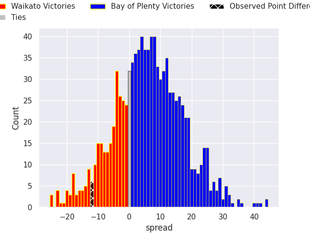
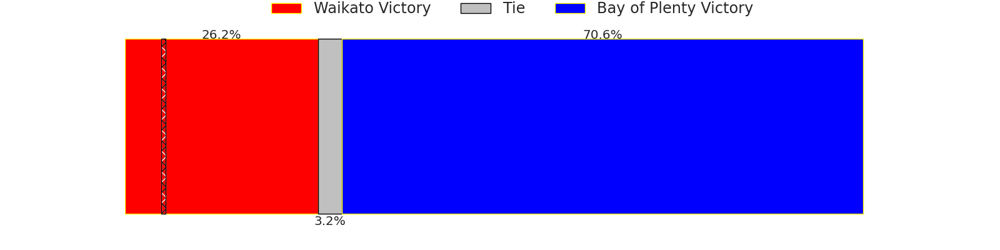

# Waikato V Bay of Plenty on 2026/07/30, 38.0 to 26.0

# Club Level Predictions

Now that the game has been played, lets see how the club predictions did. I predicted Bay of Plenty to win by 6.18, and Waikato won by 12.0. That's an absolute error of 18.2 for the margin of victory, while my average absolute error has been 14.9 over the past six months. This prediction was more accurate than 30.7% of my recent predictions.

For the Over/Under model, I predicted a total of 49.5 and we have an actual total of 64.0. That's an absolute error of 14.5 compared to a six month average of 14.3. This prediction was more accurate than 40.7% of my recent predictions.
## Projected Performances - Club Model

## Projected Spreads - Club Model

## Projected Results - Club Model

