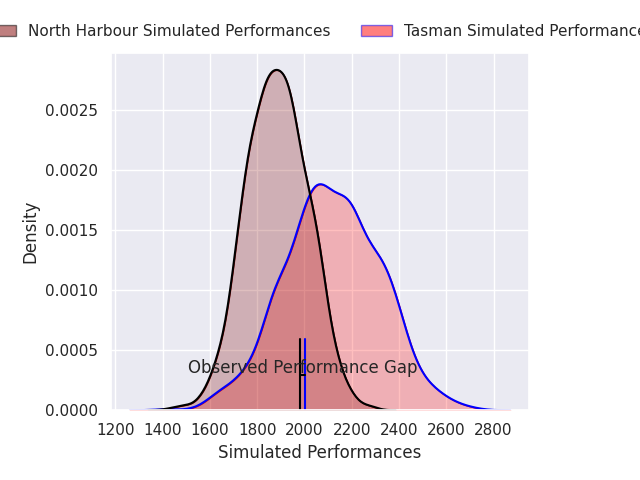
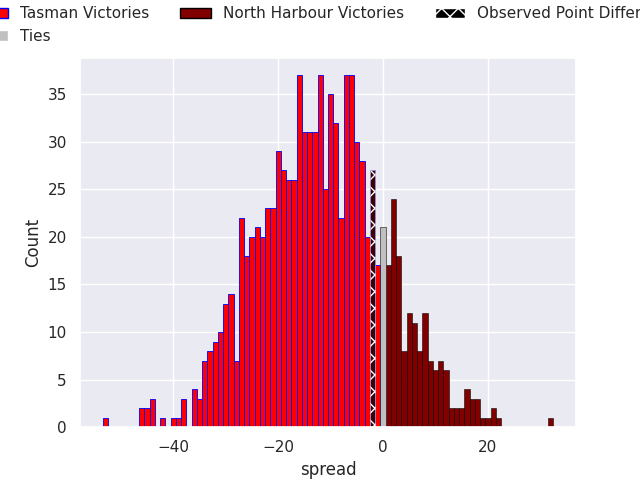
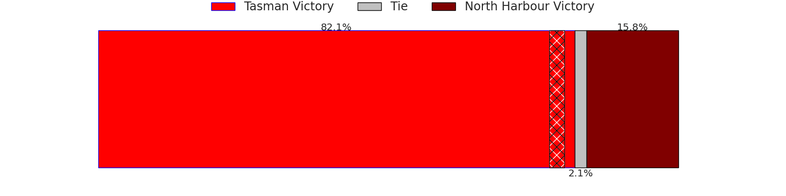

# Tasman V North Harbour on 2026/07/31, 31.0 to 29.0

# Club Level Predictions

Now that the game has been played, lets see how the club predictions did. I predicted Tasman to win by 11.67, and Tasman won by 2.0. That's an absolute error of 9.7 for the margin of victory, while my average absolute error has been 14.8 over the past six months. This prediction was more accurate than 57.8% of my recent predictions.

For the Over/Under model, I predicted a total of 49.5 and we have an actual total of 60.0. That's an absolute error of 10.5 compared to a six month average of 14.3. This prediction was more accurate than 54.4% of my recent predictions.
## Projected Performances - Club Model

## Projected Spreads - Club Model

## Projected Results - Club Model

