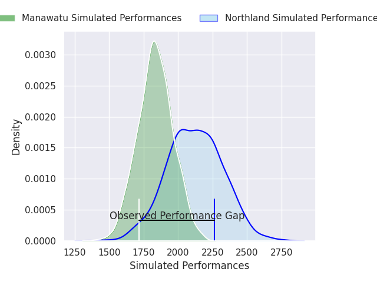
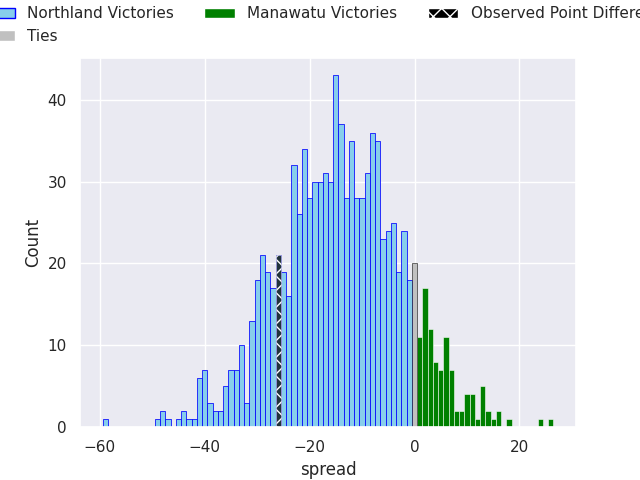
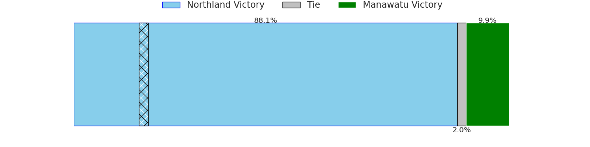

# Northland V Manawatu on 2026/08/01, 40.0 to 14.0

# Club Level Predictions

Now that the game has been played, lets see how the club predictions did. I predicted Northland to win by 14.22, and Northland won by 26.0. That's an absolute error of 11.8 for the margin of victory, while my average absolute error has been 15.0 over the past six months. This prediction was more accurate than 50.8% of my recent predictions.

For the Over/Under model, I predicted a total of 49.5 and we have an actual total of 54.0. That's an absolute error of 4.5 compared to a six month average of 14.4. This prediction was more accurate than 80.5% of my recent predictions.
## Projected Performances - Club Model

## Projected Spreads - Club Model

## Projected Results - Club Model

