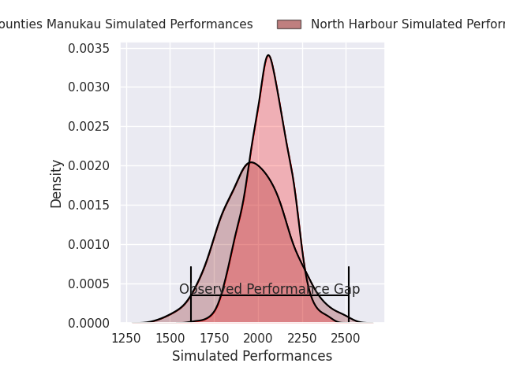
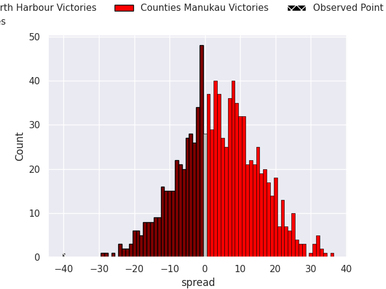
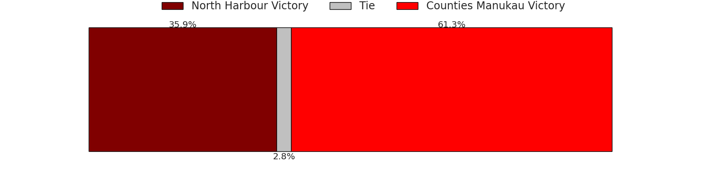

# North Harbour V Counties Manukau on 2026/08/06, 59.0 to 19.0

# Club Level Predictions

Now that the game has been played, lets see how the club predictions did. I predicted Counties Manukau to win by 3.88, and North Harbour won by 40.0. That's an absolute error of 43.9 for the margin of victory, while my average absolute error has been 15.0 over the past six months. This prediction was more accurate than 3.3% of my recent predictions.

For the Over/Under model, I predicted a total of 49.5 and we have an actual total of 78.0. That's an absolute error of 28.5 compared to a six month average of 14.4. This prediction was more accurate than 11.7% of my recent predictions.
## Projected Performances - Club Model

## Projected Spreads - Club Model

## Projected Results - Club Model

