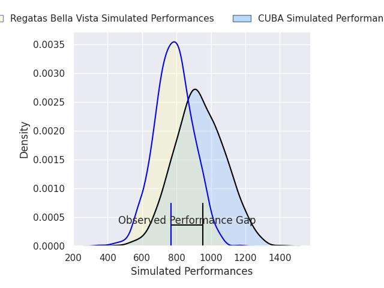
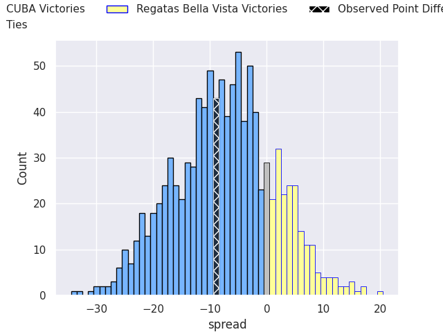
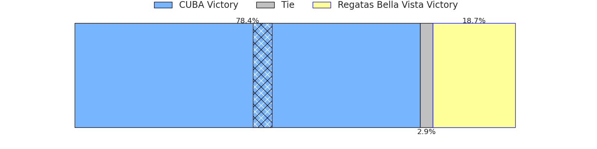

# CUBA V Regatas Bella Vista on 2026/08/15, 19.0 to 10.0

# Club Level Predictions

Now that the game has been played, lets see how the club predictions did. I predicted Regatas Bella Vista to win by 0.46, and CUBA won by 9.0. That's an absolute error of 9.5 for the margin of victory, while my average absolute error has been 14.7 over the past six months. This prediction was more accurate than 58.8% of my recent predictions.

For the Over/Under model, I predicted a total of 49.5 and we have an actual total of 29.0. That's an absolute error of 20.5 compared to a six month average of 14.3. This prediction was more accurate than 25.7% of my recent predictions.
## Projected Performances - Club Model

## Projected Spreads - Club Model

## Projected Results - Club Model

# Player Level Predictions

With the player model, I predicted CUBA to win by 7.5,  and CUBA won by 9.0. That's an absolute error of 1.5 for the margin of victory, while the average error as been 15.0 for the past six months. So this prediction was more accurate than 81.5% of my recent predictions.
## Projected Performances - Player Model

## Projected Spreads - Player Model

## Projected Results - Player Model

