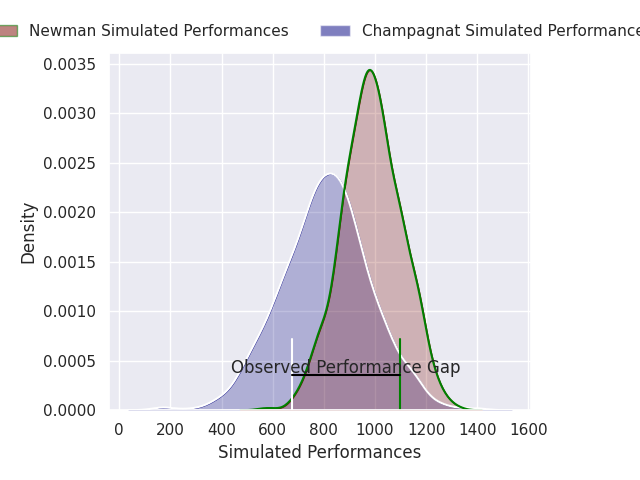
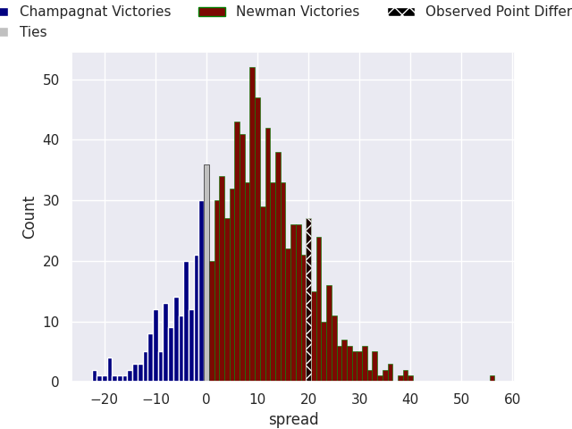
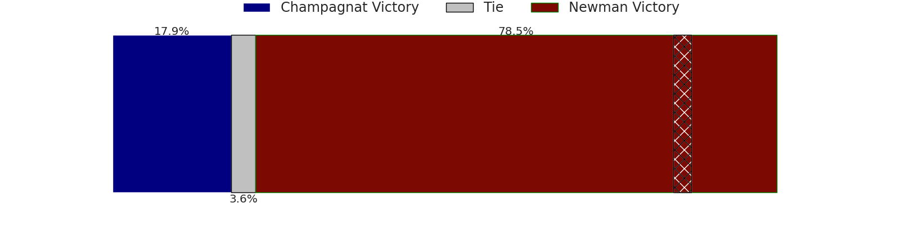

# Champagnat V Newman on 2026/08/22, 21.0 to 41.0

# Club Level Predictions

Now that the game has been played, lets see how the club predictions did. I predicted Newman to win by 13.67, and Newman won by 20.0. That's an absolute error of 6.3 for the margin of victory, while my average absolute error has been 14.8 over the past six months. This prediction was more accurate than 70.9% of my recent predictions.

For the Over/Under model, I predicted a total of 51.5 and we have an actual total of 62.0. That's an absolute error of 10.5 compared to a six month average of 14.3. This prediction was more accurate than 54.0% of my recent predictions.
## Projected Performances - Club Model

## Projected Spreads - Club Model

## Projected Results - Club Model

# Player Level Predictions

With the player model, I predicted Newman to win by 8.93,  and Newman won by 20.0. That's an absolute error of 11.1 for the margin of victory, while the average error as been 15.1 for the past six months. So this prediction was more accurate than 46.8% of my recent predictions.
## Projected Performances - Player Model

## Projected Spreads - Player Model

## Projected Results - Player Model

