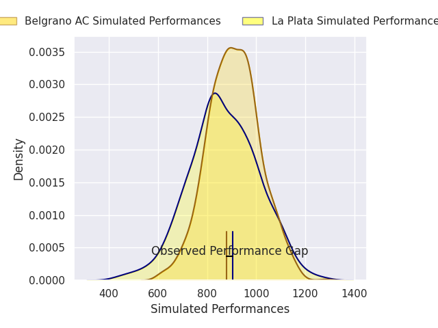
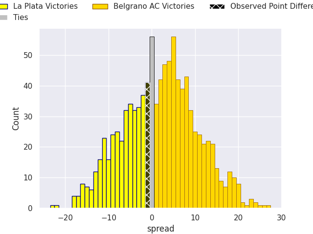
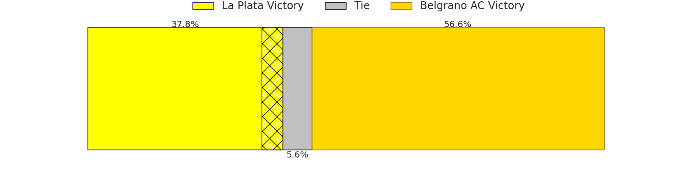

# La Plata V Belgrano AC on 2026/08/22, 34.0 to 33.0

# Club Level Predictions

Now that the game has been played, lets see how the club predictions did. I predicted Belgrano AC to win by 3.16, and La Plata won by 1.0. That's an absolute error of 4.2 for the margin of victory, while my average absolute error has been 14.8 over the past six months. This prediction was more accurate than 81.0% of my recent predictions.

For the Over/Under model, I predicted a total of 56.5 and we have an actual total of 67.0. That's an absolute error of 10.5 compared to a six month average of 14.3. This prediction was more accurate than 53.8% of my recent predictions.
## Projected Performances - Club Model

## Projected Spreads - Club Model

## Projected Results - Club Model

# Player Level Predictions

With the player model, I predicted Belgrano AC to win by 1.98,  and La Plata won by 1.0. That's an absolute error of 3.0 for the margin of victory, while the average error as been 15.1 for the past six months. So this prediction was more accurate than 75.4% of my recent predictions.
## Projected Performances - Player Model

## Projected Spreads - Player Model

## Projected Results - Player Model

