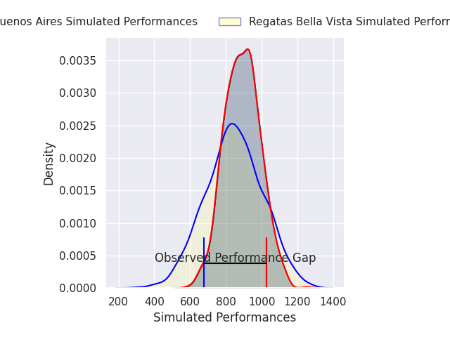
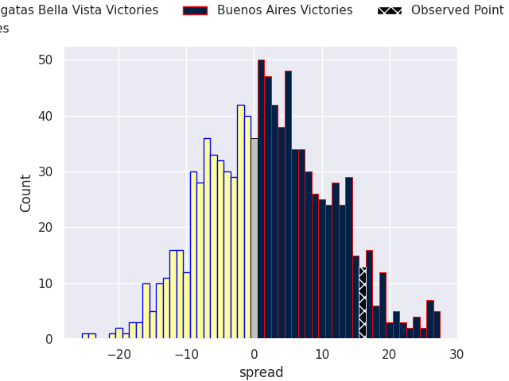
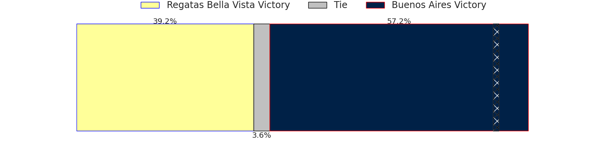

# Regatas Bella Vista V Buenos Aires on 2026/08/22, 16.0 to 32.0

# Club Level Predictions

Now that the game has been played, lets see how the club predictions did. I predicted Regatas Bella Vista to win by 1.61, and Buenos Aires won by 16.0. That's an absolute error of 17.6 for the margin of victory, while my average absolute error has been 14.8 over the past six months. This prediction was more accurate than 31.4% of my recent predictions.

For the Over/Under model, I predicted a total of 49.5 and we have an actual total of 48.0. That's an absolute error of 1.5 compared to a six month average of 14.3. This prediction was more accurate than 94.1% of my recent predictions.
## Projected Performances - Club Model

## Projected Spreads - Club Model

## Projected Results - Club Model

# Player Level Predictions

With the player model, I predicted Buenos Aires to win by 2.25,  and Buenos Aires won by 16.0. That's an absolute error of 13.8 for the margin of victory, while the average error as been 15.1 for the past six months. So this prediction was more accurate than 39.6% of my recent predictions.
## Projected Performances - Player Model

## Projected Spreads - Player Model

## Projected Results - Player Model

