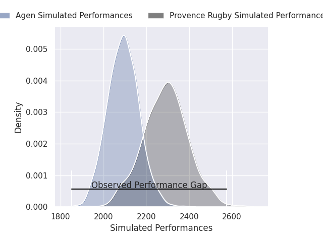
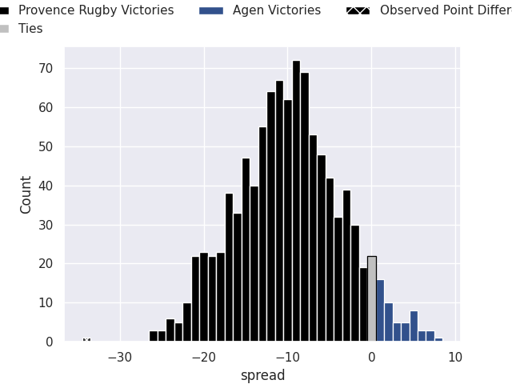
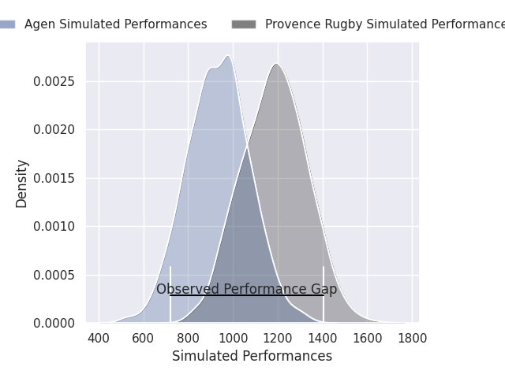
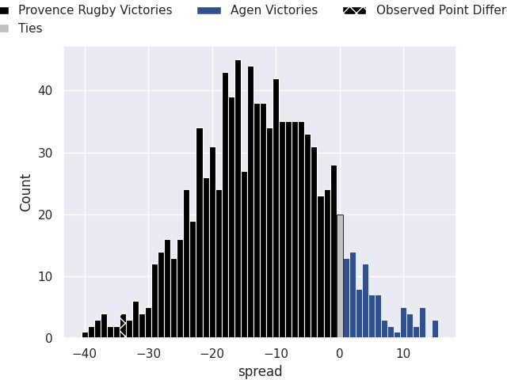
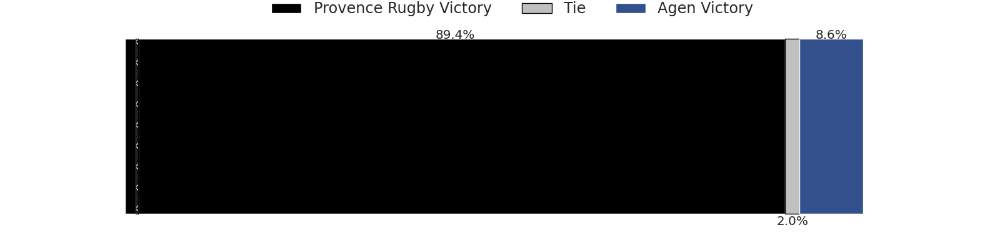

# Provence Rugby V Agen on 2026/08/27, 44.0 to 10.0

# Club Level Predictions

Now that the game has been played, lets see how the club predictions did. I predicted Provence Rugby to win by 9.9, and Provence Rugby won by 34.0. That's an absolute error of 24.1 for the margin of victory, while my average absolute error has been 15.0 over the past six months. This prediction was more accurate than 19.7% of my recent predictions.

For the Over/Under model, I predicted a total of 49.5 and we have an actual total of 54.0. That's an absolute error of 4.5 compared to a six month average of 14.4. This prediction was more accurate than 79.6% of my recent predictions.
## Projected Performances - Club Model

## Projected Spreads - Club Model

## Projected Results - Club Model

# Player Level Predictions

With the player model, I predicted Provence Rugby to win by 12.46,  and Provence Rugby won by 34.0. That's an absolute error of 21.5 for the margin of victory, while the average error as been 15.3 for the past six months. So this prediction was more accurate than 21.5% of my recent predictions.
## Projected Performances - Player Model

## Projected Spreads - Player Model

## Projected Results - Player Model

