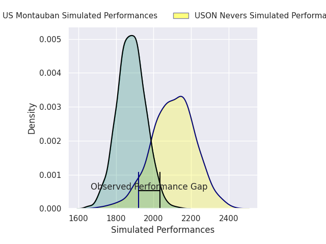
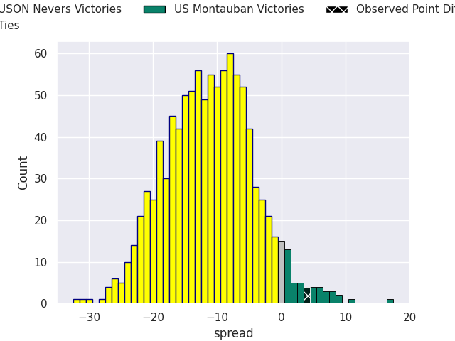
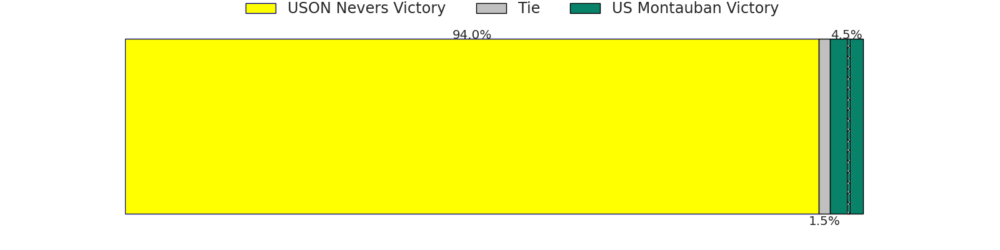
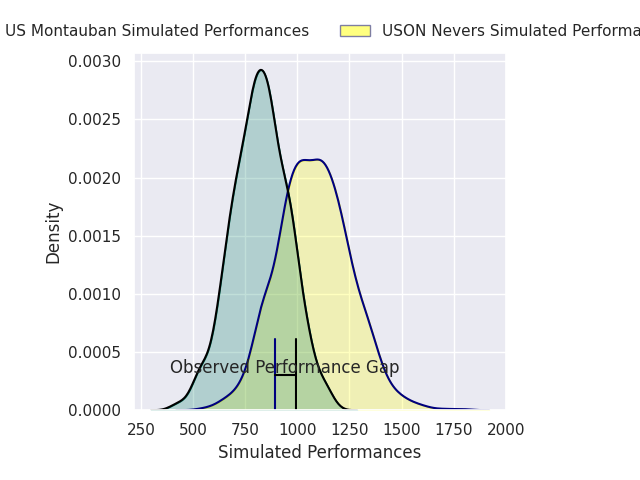
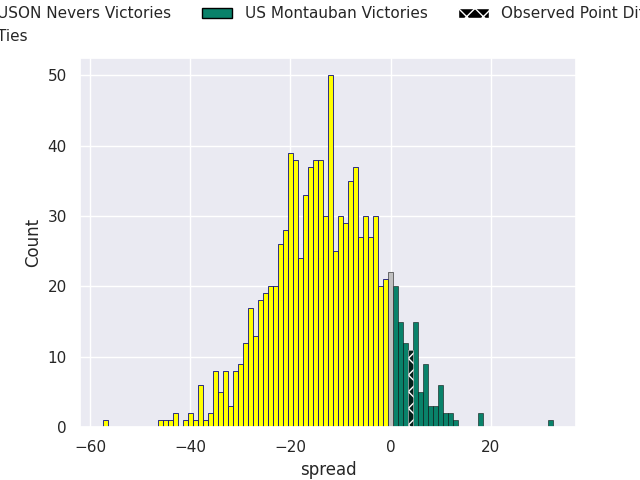
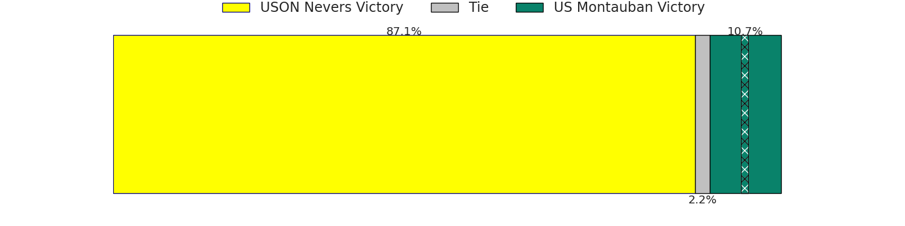

# USON Nevers V US Montauban on 2026/08/27, 21.0 to 25.0

# Club Level Predictions

Now that the game has been played, lets see how the club predictions did. I predicted USON Nevers to win by 11.17, and US Montauban won by 4.0. That's an absolute error of 15.2 for the margin of victory, while my average absolute error has been 15.0 over the past six months. This prediction was more accurate than 39.9% of my recent predictions.

For the Over/Under model, I predicted a total of 52.5 and we have an actual total of 46.0. That's an absolute error of 6.5 compared to a six month average of 14.4. This prediction was more accurate than 71.2% of my recent predictions.
## Projected Performances - Club Model

## Projected Spreads - Club Model

## Projected Results - Club Model

# Player Level Predictions

With the player model, I predicted USON Nevers to win by 12.91,  and US Montauban won by 4.0. That's an absolute error of 16.9 for the margin of victory, while the average error as been 15.3 for the past six months. So this prediction was more accurate than 30.8% of my recent predictions.
## Projected Performances - Player Model

## Projected Spreads - Player Model

## Projected Results - Player Model

