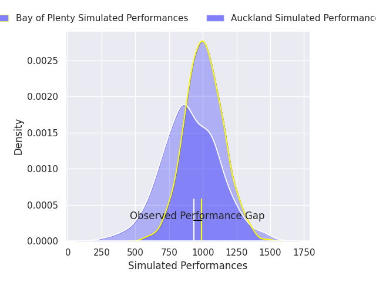
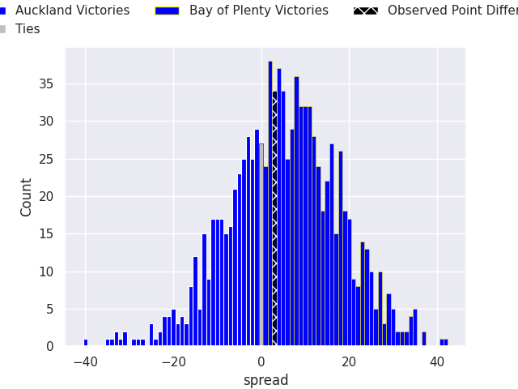
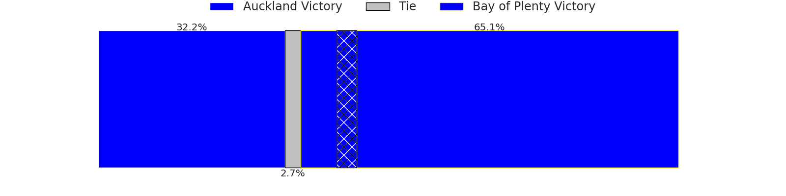

# Auckland V Bay of Plenty on 2026/08/28, 19.0 to 22.0

# Club Level Predictions

Now that the game has been played, lets see how the club predictions did. I predicted Bay of Plenty to win by 6.42, and Bay of Plenty won by 3.0. That's an absolute error of 3.4 for the margin of victory, while my average absolute error has been 15.0 over the past six months. This prediction was more accurate than 84.5% of my recent predictions.

For the Over/Under model, I predicted a total of 51.5 and we have an actual total of 41.0. That's an absolute error of 10.5 compared to a six month average of 14.4. This prediction was more accurate than 53.6% of my recent predictions.
## Projected Performances - Club Model

## Projected Spreads - Club Model

## Projected Results - Club Model

# Player Level Predictions

With the player model, I predicted Bay of Plenty to win by 5.06,  and Bay of Plenty won by 3.0. That's an absolute error of 2.1 for the margin of victory, while the average error as been 15.3 for the past six months. So this prediction was more accurate than 78.7% of my recent predictions.
## Projected Performances - Player Model

## Projected Spreads - Player Model

## Projected Results - Player Model

