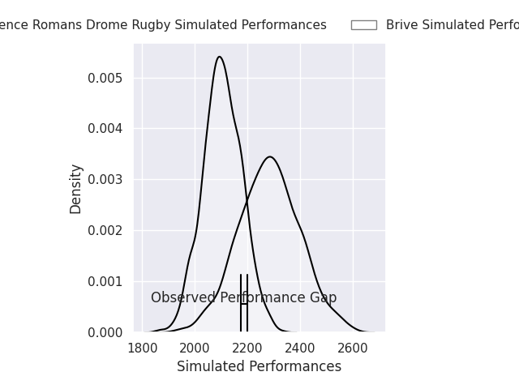
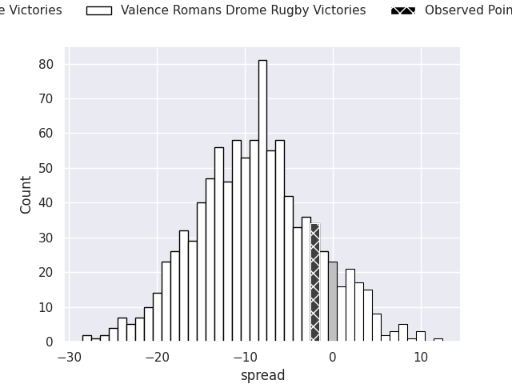
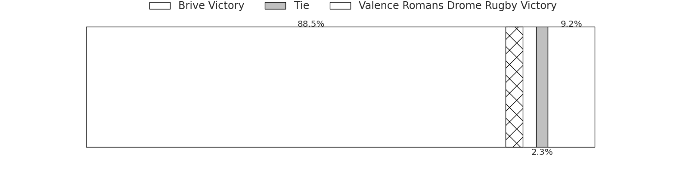
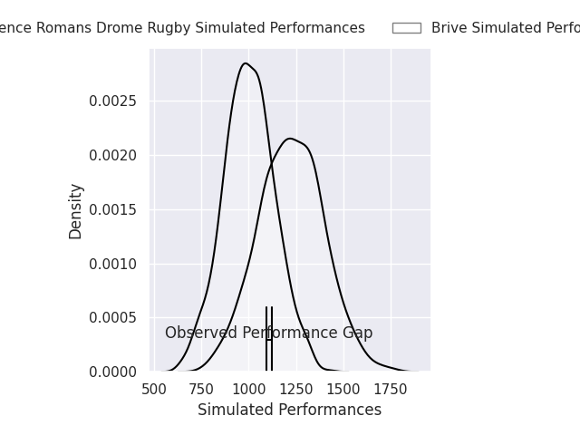
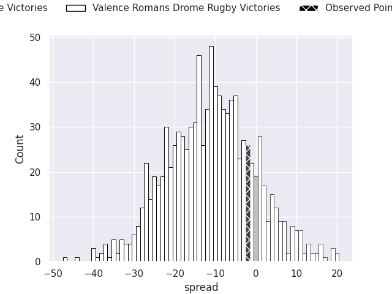
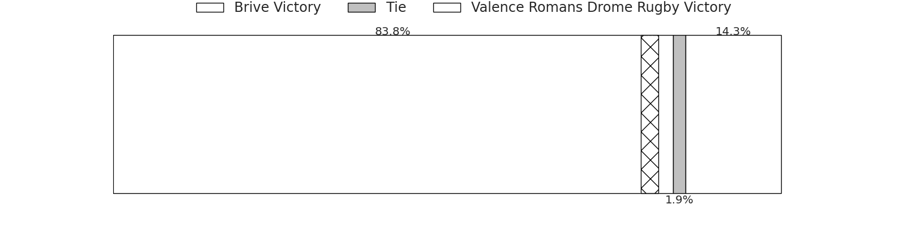

# Brive V Valence Romans Drome Rugby on 2026/08/28, 23.0 to 21.0

# Club Level Predictions

Now that the game has been played, lets see how the club predictions did. I predicted Brive to win by 8.9, and Brive won by 2.0. That's an absolute error of 6.9 for the margin of victory, while my average absolute error has been 15.0 over the past six months. This prediction was more accurate than 68.3% of my recent predictions.

For the Over/Under model, I predicted a total of 48.5 and we have an actual total of 44.0. That's an absolute error of 4.5 compared to a six month average of 14.4. This prediction was more accurate than 79.6% of my recent predictions.
## Projected Performances - Club Model

## Projected Spreads - Club Model

## Projected Results - Club Model

# Player Level Predictions

With the player model, I predicted Brive to win by 11.16,  and Brive won by 2.0. That's an absolute error of 9.2 for the margin of victory, while the average error as been 15.3 for the past six months. So this prediction was more accurate than 53.0% of my recent predictions.
## Projected Performances - Player Model

## Projected Spreads - Player Model

## Projected Results - Player Model

