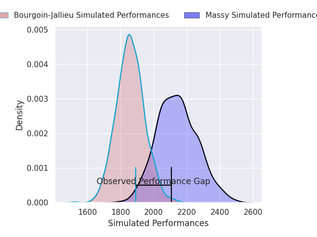
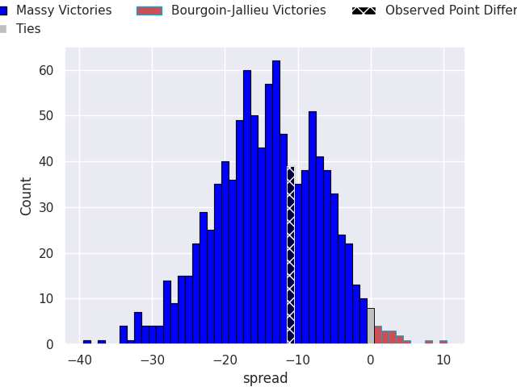
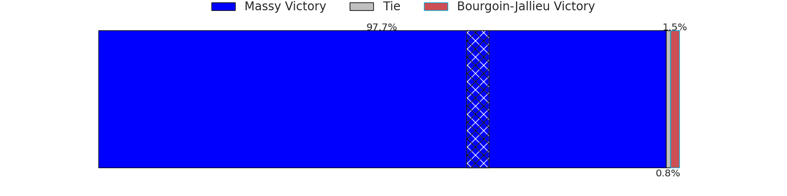

# Massy V Bourgoin-Jallieu on 2026/08/28, 28.0 to 17.0

# Club Level Predictions

Now that the game has been played, lets see how the club predictions did. I predicted Massy to win by 14.05, and Massy won by 11.0. That's an absolute error of 3.1 for the margin of victory, while my average absolute error has been 15.0 over the past six months. This prediction was more accurate than 85.6% of my recent predictions.

For the Over/Under model, I predicted a total of 45.5 and we have an actual total of 45.0. That's an absolute error of 0.5 compared to a six month average of 14.4. This prediction was more accurate than 98.0% of my recent predictions.
## Projected Performances - Club Model

## Projected Spreads - Club Model

## Projected Results - Club Model

