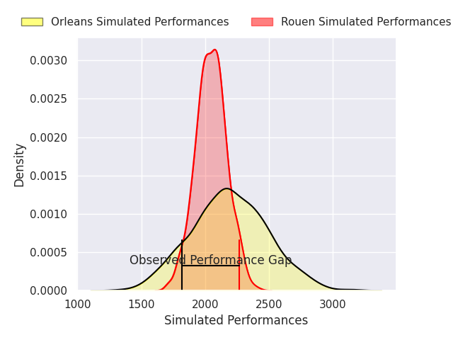
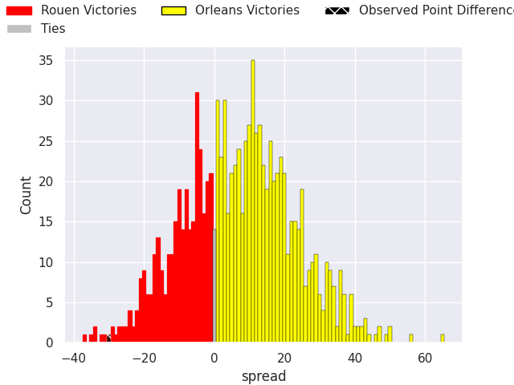
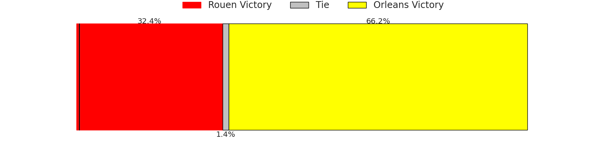

# Rouen V Orleans on 2026/08/28, 59.0 to 29.0

# Club Level Predictions

Now that the game has been played, lets see how the club predictions did. I predicted Orleans to win by 7.15, and Rouen won by 30.0. That's an absolute error of 37.2 for the margin of victory, while my average absolute error has been 14.8 over the past six months. This prediction was more accurate than 6.5% of my recent predictions.

For the Over/Under model, I predicted a total of 41.5 and we have an actual total of 88.0. That's an absolute error of 46.5 compared to a six month average of 14.2. This prediction was more accurate than 1.4% of my recent predictions.
## Projected Performances - Club Model

## Projected Spreads - Club Model

## Projected Results - Club Model

