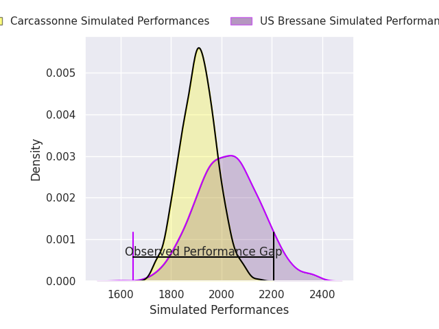
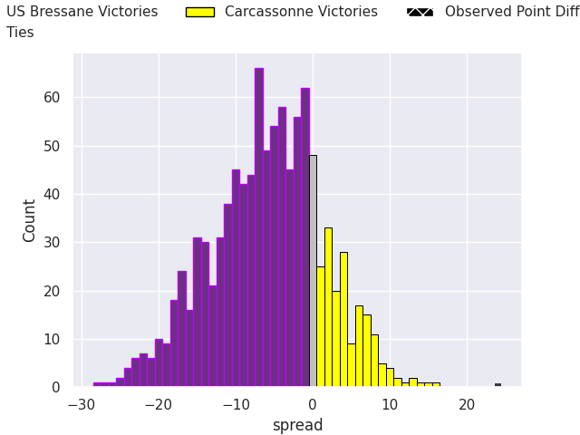

# US Bressane V Carcassonne on 2026/08/28, 12.0 to 36.0

# Club Level Predictions

Now that the game has been played, lets see how the club predictions did. I predicted US Bressane to win by 5.91, and Carcassonne won by 24.0. That's an absolute error of 29.9 for the margin of victory, while my average absolute error has been 14.8 over the past six months. This prediction was more accurate than 11.8% of my recent predictions.

For the Over/Under model, I predicted a total of 42.5 and we have an actual total of 48.0. That's an absolute error of 5.5 compared to a six month average of 14.2. This prediction was more accurate than 74.6% of my recent predictions.
## Projected Performances - Club Model

## Projected Spreads - Club Model

## Projected Results - Club Model

