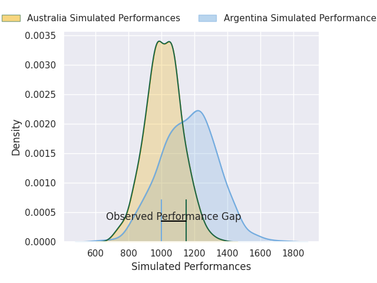
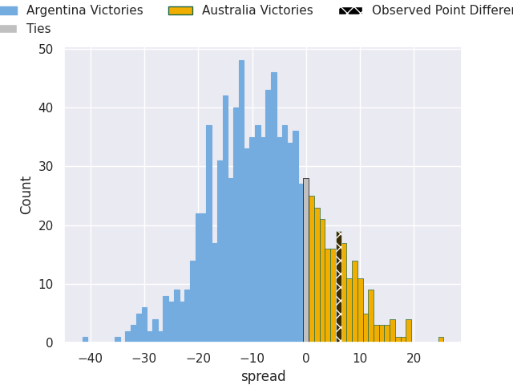
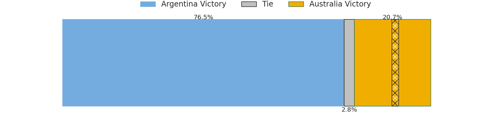

# Argentina V Australia on 2026/08/29, 21.0 to 27.0

# Club Level Predictions

Now that the game has been played, lets see how the club predictions did. I predicted Argentina to win by 6.2, and Australia won by 6.0. That's an absolute error of 12.2 for the margin of victory, while my average absolute error has been 15.0 over the past six months. This prediction was more accurate than 50.1% of my recent predictions.

For the Over/Under model, I predicted a total of 50.5 and we have an actual total of 48.0. That's an absolute error of 2.5 compared to a six month average of 14.4. This prediction was more accurate than 89.6% of my recent predictions.
## Projected Performances - Club Model

## Projected Spreads - Club Model

## Projected Results - Club Model

# Player Level Predictions

With the player model, I predicted Argentina to win by 7.58,  and Australia won by 6.0. That's an absolute error of 13.6 for the margin of victory, while the average error as been 15.3 for the past six months. So this prediction was more accurate than 40.4% of my recent predictions.
## Projected Performances - Player Model

## Projected Spreads - Player Model

## Projected Results - Player Model

