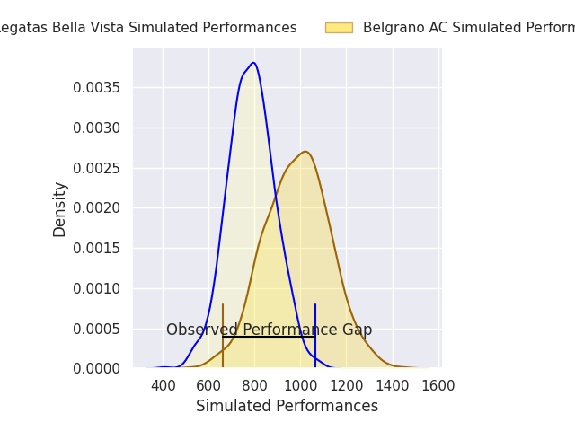
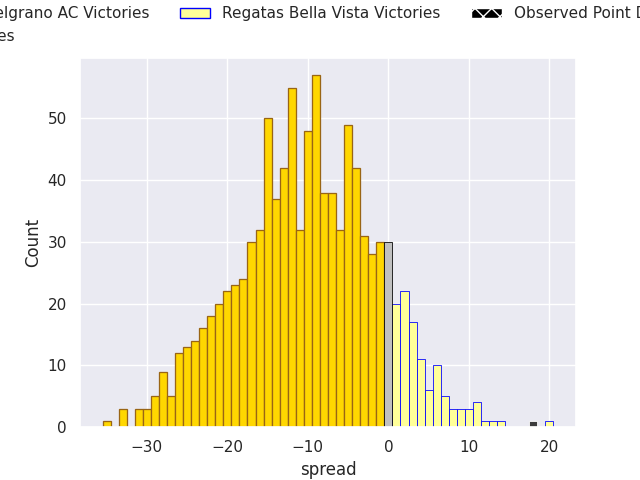
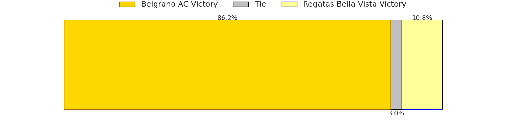

# Belgrano AC V Regatas Bella Vista on 2026/08/29, 8.0 to 26.0

# Club Level Predictions

Now that the game has been played, lets see how the club predictions did. I predicted Belgrano AC to win by 11.06, and Regatas Bella Vista won by 18.0. That's an absolute error of 29.1 for the margin of victory, while my average absolute error has been 15.0 over the past six months. This prediction was more accurate than 13.3% of my recent predictions.

For the Over/Under model, I predicted a total of 51.5 and we have an actual total of 34.0. That's an absolute error of 17.5 compared to a six month average of 14.4. This prediction was more accurate than 33.1% of my recent predictions.
## Projected Performances - Club Model

## Projected Spreads - Club Model

## Projected Results - Club Model

# Player Level Predictions

With the player model, I predicted Belgrano AC to win by 10.04,  and Regatas Bella Vista won by 18.0. That's an absolute error of 28.0 for the margin of victory, while the average error as been 15.3 for the past six months. So this prediction was more accurate than 13.0% of my recent predictions.
## Projected Performances - Player Model

## Projected Spreads - Player Model

## Projected Results - Player Model

